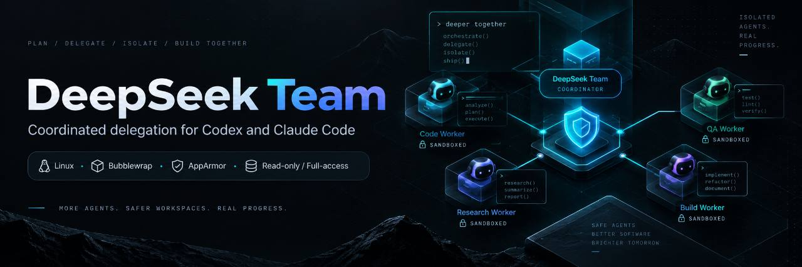

# DeepSeek Team

**English** | [Русский](README.ru.md)

One Linux package for **Codex and/or Claude Code coordinators** delegating bounded coding work to DeepSeek workers. The current source supports configurable **25/50/75% delegation profiles**, independent `read-only/full-access` policy, and reusable isolated development copies.

**The coordinator owns:** scope, architecture, security decisions, final diff review, integration, commits and production actions. **DeepSeek contributes:** focused research/review and, when full-access is selected, independent implementation, local tests/builds and documentation inside a dedicated copy. DeepSeek workers stay on `deepseek-flash`; effort defaults to `auto`, so the frontier coordinator chooses `low`/`medium`/`high` per assignment unless a persistent forced effort is configured. Codex/Claude may also use their own native subagents when they can state a concrete reason for doing so; native subagents complement rather than replace required DeepSeek assignments. The coordinator should verify useful evidence instead of automatically repeating the whole delegated investigation or rewriting correct code.

The percentages are **target work-distribution profiles**, not measured token/time/line quotas and not promises of exact useful contribution. Small or inseparable tasks may delegate less. Without any new settings, behavior remains compatible: the default is **25% + access=auto → read-only**.

Version **0.6.0** adds frontier-selected DeepSeek effort with persistent `auto|low|medium|high` policy, preserves justified native Codex/Claude subagents alongside DeepSeek workers, and keeps DeepSeek workers fixed on `deepseek-flash` as isolated leaf workers. Version 0.5.0 introduced persistent coordination state and Codex lifecycle enforcement. The release supports **Linux, Python 3.11+, Git, Bubblewrap, and Codex CLI and/or Claude Code CLI**. Ubuntu has first-class AppArmor setup for its restricted unprivileged-user-namespace policy. A DeepSeek API key is required for live work. There are no Python runtime dependencies; Bubblewrap/AppArmor are system components.

The current source also supports Claude Code coordination hooks: both coordinators use the persistent task ledger and the saved project `on/off` switch.

## Ubuntu install — recommended

Install the coordinator CLI(s) you intend to use, then:

```bash
git clone https://github.com/kirill31337/deepseek-team.git
cd deepseek-team
python3 install.py --with-sandbox
export PATH="$HOME/.local/bin:$PATH"
deepseek-team sandbox status
```

`--with-sandbox` is an **explicit privileged setup path**. On Ubuntu it installs the `bubblewrap` and `apparmor` packages, installs/reloads the package-owned named profile `deepseek-team-bwrap`, and probes the resulting sandbox. It does **not** disable AppArmor and does **not** change `kernel.apparmor_restrict_unprivileged_userns`.

Then configure whichever coordinator(s) you use:

```bash
# Codex only
deepseek-team setup --runtime codex
deepseek-team hooks status
deepseek-team doctor --runtime codex --offline
deepseek-team init --coordinator codex
# In Codex, review/trust the stable hook definition once with /hooks.

# Claude Code only
deepseek-team setup --runtime claude
deepseek-team hooks status --runtime claude
deepseek-team doctor --runtime claude --offline
deepseek-team init --coordinator claude
# Start a new Claude session and check /hooks.

# Or both
deepseek-team setup --runtime both
deepseek-team doctor --runtime both --offline
deepseek-team init --coordinator both
```

The installer creates a dedicated venv at `~/.local/share/codex-deepseek-team/venv` and publishes two equivalent commands:

```text
deepseek-team
codex-deepseek-team   # legacy compatibility alias
```

The legacy Python distribution/namespace is intentionally preserved so existing installations and automation continue to work.

### Codex lifecycle hooks

Starting with **0.5.0**, the standard installer detects Codex on `PATH` and installs or refreshes the stable DeepSeek Team user-level lifecycle hooks in `$CODEX_HOME/hooks.json`. `deepseek-team setup --runtime codex` also installs the same hook definition while preserving the primary Codex model and existing OpenAI authentication.

Useful commands:

```bash
deepseek-team hooks install
deepseek-team hooks status
deepseek-team hooks remove
```

The user-level hook is deliberately inert in unrelated repositories. Coordinator enforcement becomes active only in a repository explicitly attached with:

```bash
deepseek-team init --coordinator codex /path/to/project
```

Codex owns native hook trust. Review/trust the stable DeepSeek Team hook once from Codex with `/hooks`; DeepSeek Team does not bypass or infer that decision. Normal package updates keep the same hook command and **do not require re-running `init` for projects that are already attached**.

`hooks remove` removes only the package-owned DeepSeek Team handlers and preserves unrelated user hooks.

### Claude Code lifecycle hooks

The standard installer also detects Claude Code on `PATH`. It installs DeepSeek Team handlers in `~/.claude/settings.json`, or in `$CLAUDE_CONFIG_DIR/settings.json` when that environment variable is set. `setup --runtime claude` installs the same handlers. Existing model, permissions, credentials and unrelated hooks are preserved. Projects opt in with `deepseek-team init --coordinator claude`.

```bash
deepseek-team hooks install --runtime claude
deepseek-team hooks status --runtime claude
deepseek-team hooks remove --runtime claude
```

Use `--runtime both` for both coordinators, or `--runtime auto` for those found on `PATH`. Without the flag, `hooks` continues to target Codex.

After installation, start a new Claude session and check `/hooks`. `hooks status` verifies the user-level definitions; it cannot confirm which hooks a running session has loaded. Claude's `disableAllHooks`, managed settings, or `--bare` can disable them. Installation preserves those settings. The [Claude hook reference](https://code.claude.com/docs/en/hooks) describes the native controls.

When updating an already attached Claude project, `deepseek-team init --coordinator claude .` can refresh old instructions that described delegation as instruction-driven. The existing project marker already enables the new handlers, and later package updates or `on/off` changes do not require another `init`.

## Install with an agent prompt

You can ask Codex to install or update DeepSeek Team for the repository it is currently working in. Paste this short prompt into Codex from the project you want to enable:

```text
Install or update DeepSeek Team in this Linux project from https://github.com/kirill31337/deepseek-team. Use the repository's standard install.py; on Ubuntu use --with-sandbox unless a working DeepSeek Team sandbox is already configured. Preserve my existing Codex model/auth, DeepSeek Team settings, and credential. Configure Codex support without asking me to paste secrets into this prompt; if no DeepSeek key exists, leave secret entry to "deepseek-team auth set". Ensure the stable Codex lifecycle hooks are installed and healthy with "deepseek-team hooks install" and "deepseek-team hooks status". If this repository does not already contain the DeepSeek Team managed block in AGENTS.md, attach it with "deepseek-team init --coordinator codex ."; if it is already attached, do not re-run init just because the package was updated. Verify "deepseek-team --version", "deepseek-team sandbox status", "deepseek-team hooks status", and "deepseek-team doctor --runtime codex --offline". Do not use --os-sandbox off and do not weaken AppArmor/Bubblewrap. If the hooks require native Codex trust/review, use the Codex "/hooks" interface and approve/trust the DeepSeek Team package-owned hooks yourself when the current Codex environment permits it. Do not bypass Codex hook trust or modify trust state outside the native Codex mechanism. Afterwards verify with "deepseek-team hooks status". Only ask me to approve the hooks manually if native approval cannot be completed from the current Codex session.
```

The prompt intentionally does **not** contain an API key and does not change your delegation level, access policy, or saved effort policy. Configure the private DeepSeek credential separately with `deepseek-team auth set`, and set `delegation_level` / `access` / `effort` explicitly if you want values other than the existing configuration or defaults.

### Rootless/manual install

Plain installation never invokes `sudo`:

```bash
python3 install.py
export PATH="$HOME/.local/bin:$PATH"
deepseek-team sandbox status
```

If `sandbox status` succeeds, no AppArmor change is needed. If Ubuntu blocks Bubblewrap while `kernel.apparmor_restrict_unprivileged_userns=1`, install the package profile explicitly:

```bash
deepseek-team sandbox install-apparmor
deepseek-team sandbox status
```

or rerun `python3 install.py --with-sandbox`.

On other Linux distributions, install Bubblewrap using the distribution package manager and run `deepseek-team sandbox status`. The package-managed AppArmor profile is specifically intended for Ubuntu/AppArmor user-namespace mediation.

**Do not solve Ubuntu failures with** `sudo sysctl -w kernel.apparmor_restrict_unprivileged_userns=0`. DeepSeek Team intentionally keeps the host restriction enabled and grants user-namespace creation only through its named AppArmor path when that fallback is needed.

You can alternatively use `pipx install .` or a venv, but you still need a working system Bubblewrap backend before workers run.

## Why AppArmor + Bubblewrap

Ubuntu can deny unprivileged applications access to user namespaces unless an AppArmor profile explicitly permits them. DeepSeek Team therefore ships this **named, non-attached** profile:

```text
profile deepseek-team-bwrap flags=(unconfined) {
  userns,
}
```

It is selected explicitly with `aa-exec -p deepseek-team-bwrap -- ...`. The profile does not attach globally to `/usr/bin/bwrap`, so it avoids replacing or competing with distribution/administrator profiles. Its job is only to permit creation of the initial user namespace; **Bubblewrap defines the actual filesystem/process sandbox policy**.

Worker startup is fail-closed by default:

1. locate `bwrap` and verify the required options;
2. try a direct user-namespace probe;
3. if Ubuntu AppArmor blocks direct Bubblewrap and the restriction is active, retry through `aa-exec -p deepseek-team-bwrap`;
4. if neither path works, stop **before reading the DeepSeek credential**.

There is no automatic unsandboxed fallback.

## Isolation modes

Read-only workers retain their runtime-specific boundary. Managed development copies used by full-access use a stricter sparse outer Bubblewrap boundary for **both** runtimes.

### Read-only runtime boundary

### Codex worker

Current Codex on Linux already has its own Bubblewrap-backed sandbox. Nesting Codex inside another Bubblewrap namespace with further user-namespace creation disabled would break that native sandbox.

DeepSeek Team therefore:

- probes a usable system/AppArmor-aware Bubblewrap backend before worker credentials are read;
- creates a private temporary `bwrap` shim inside the worker session;
- puts that shim first on the worker `PATH`;
- lets **Codex itself** build its normal Linux sandbox using that verified `bwrap` path;
- keeps the delegated read-only job under Codex's native `read-only` policy.

The parent Codex auth/history/rules/plugins/apps/memories are not copied; the worker receives a temporary `HOME`/`CODEX_HOME` and only the DeepSeek provider configuration it needs.

### Claude Code worker

Claude Code does not provide the same native Linux Bubblewrap boundary for these built-in file tools, so DeepSeek Team puts the entire isolated Claude worker harness inside an **outer Bubblewrap namespace**:

- read-only root filesystem;
- fresh process/user/IPC/UTS namespaces;
- dropped capabilities;
- private `/tmp` and `/var/tmp`;
- real user HOME masked, with only runtime roots needed to start the CLI re-exposed read-only;
- common credential stores masked again after runtime mounts;
- temporary worker HOME writable;
- repository/worktree mounted read-only;
- `--disable-userns` prevents the worker payload from creating another user namespace.

Claude itself still runs `--bare`, with no session persistence. Built-in tools are restricted to `Read,Glob,Grep`; Bash, web tools and agents are absent, and MCP tools are explicitly denied.

### Managed full-access boundary

For both Codex and Claude, DeepSeek Team surrounds managed development copies with a sparse Bubblewrap namespace that exposes only the owned working copy, required runtime prefixes, a temporary HOME and a per-run control directory. Git administrative files are remounted read-only. The namespace uses `--unshare-net`; the worker cannot reach arbitrary host/network services.

DeepSeek API access is provided only through a fixed-destination host relay connected to the namespace through a per-run Unix socket and namespace-local loopback bridge. The real provider credential stays in the host-side relay; the isolated runtime sees only a synthetic local credential. The relay is not a general proxy and accepts only the provider endpoints needed by the supported runtime protocols.

Full-access therefore means **full development access to the assigned copy**, not full host access. It does not grant access to the user's other checkouts, dirty source checkout, secrets, production databases, system services, deployment credentials, publishing or Git integration/commits.

### Read-only network boundary

The read-only Claude worker must reach DeepSeek directly, so its outer sandbox intentionally does **not** unshare the network namespace. Network-facing model tools remain excluded by the Claude tool surface, while Codex keeps its own native sandbox/network policy.

## DeepSeek credential

Both runtimes share the same private DeepSeek credential:

```bash
deepseek-team auth set       # hidden terminal prompt
deepseek-team auth status    # availability only
```

The saved key is `~/.config/codex-deepseek/api-key`, directory mode `700`, file mode `600`. `DEEPSEEK_API_KEY` overrides it. For automation, pipe a secret manager to `deepseek-team auth set --stdin`. Never put a key in command arguments, repository files or worker prompts.

## Turn DeepSeek Team on or off

Run these commands from the project directory, or ask Codex or Claude Code to run them:

~~~bash
deepseek-team off       # Disable new DeepSeek jobs in this project
deepseek-team on        # Enable them again
deepseek-team status    # Show the effective and saved state
~~~

For example: “Turn off DeepSeek Team in this project” or “Turn DeepSeek Team back on.” These are terminal commands, not built-in slash commands. Both coordinators use the same saved state.

The choice persists across sessions and package updates. It is stored locally for your user, separately for each checkout, under `${XDG_CONFIG_HOME:-~/.config}/deepseek-team/activation/`. Nothing is added to Git. Commands also work from subdirectories; you can pass a project path explicitly, for example `deepseek-team off /path/to/project`. `status --json` reports the effective state, saved state and source. Outside a Git working copy, specify a project path.

By default, delegation is enabled. `off` prevents new workers from starting, including reuse of workspaces belonging to that source project, and disables Codex and Claude coordination gates on subsequent hook events. Live diagnostics also respect it. Already running workers continue; their results and coordination records are retained. `on` restores delegation with the existing access, percentage and effort settings. Credentials and project instruction files are unchanged. It does not install hooks or attach a new project; initial setup still uses `setup` and `init`.

`DEEPSEEK_TEAM_DISABLED=1` and the legacy `CODEX_DEEPSEEK_DISABLED=1` override the saved choice. If either is set, `on` saves the enabled state but reports that delegation remains disabled until the environment override is removed. `config show --effective --instructions` also reports activation and tells the coordinator to continue locally while disabled.

Both coordinators receive the current state through their installed, enabled hooks. The worker command also enforces the switch even if a chat still contains old instructions. Existing attached projects can optionally refresh their instruction blocks once with `deepseek-team init --coordinator both .` to include the new switch guidance (choose `codex` or `claude` if only one is used). Toggling itself never requires another `init`.

## Delegation profiles and access

Settings are layered independently:

`CLI arguments > project settings > global settings > defaults`.

| Profile | `access=auto` | Intended practice |
| --- | --- | --- |
| **25%** | `read-only` | Bounded research, diagnosis and review; coordinator performs the main implementation. |
| **50%** | `full-access` | Delegate independent implementation slices and their tests before doing the same work locally; coordinator owns architecture/interfaces and integration. |
| **75%** | `full-access` | Delegate most separable implementation, tests, docs and independent review; use up to three workers only when assignments are genuinely independent. |

Access is independent of the target percentage. An explicit `read-only` remains read-only at 50/75, and an explicit `full-access` can be selected at 25. Changing the percentage does not overwrite an explicit access choice; return access to `auto` when you want profile defaults again.

### DeepSeek model, effort and coordinator-native subagents

DeepSeek Team currently routes every managed worker to **`deepseek-flash`**. There is intentionally no Flash/Pro model router. The saved effort policy defaults to **`auto`**. In `auto`, the frontier Codex/Claude coordinator selects `--effort low|medium|high` for each DeepSeek assignment: `low` for bounded/mechanical work or broad scans, `medium` for the normal case, and `high` for difficult debugging, cross-file reasoning or demanding independent review. A direct worker that reaches the runner without a concrete frontier selection uses `medium` only as an execution fallback.

The primary Codex/Claude coordinator keeps its native subagent capability. For substantial work, a native-subagent deliverable is represented in the coordination plan as `"executor": "native-agent"` with a concrete `"delegation_reason"`. Native subagents are useful for genuinely parallel work, isolated context, or native-runtime capabilities, but they do **not** count as a DeepSeek worker assignment required by the 50/75 profiles. Protected coordinator responsibilities remain coordinator-owned. The DeepSeek workers themselves still have agent/delegation tools disabled and remain leaf workers.

Examples:

```bash
# Project policy
deepseek-team config set --project --delegation-level 50 --access auto

# User-wide policy
deepseek-team config set --global --delegation-level 25 --access read-only

# Effective values plus the source of each field
deepseek-team config show --effective
deepseek-team config show --effective --json

# Persist effort for this project (frontier no longer chooses per job)
deepseek-team config set --project --effort high

# Or persist it user-wide
deepseek-team config set --global --effort high

# Restore automatic frontier selection
deepseek-team config set --project --effort auto

# One-job override
deepseek-team worker --runtime codex --delegation-level 75 --access full-access --effort high
```

Project settings live in `.deepseek-team.toml`; global settings live under the user's XDG config directory. `effort` follows the same precedence as the other policy fields: one-job CLI override > project > global > default (`auto`). Settings are snapshotted when a new job starts and do not change an already running process.

`config show --effective --instructions --runtime codex|claude` renders the current coordinator guidance. Managed AGENTS.md/CLAUDE.md blocks tell the coordinator to resolve this current policy before each assignment instead of relying on a stale percentage embedded in the file.

`doctor` resolves and prints the same effective policy. When effective access is full-access it checks the managed runtime capability surface that will actually be used; it refuses to validate full-access with `--os-sandbox off`.

## Coordinator process enforcement

DeepSeek Team 0.5.0 adds a small persistent coordination ledger outside the repository. It records session/task ids, deliverables, worker assignments, workspace ids, declared dependencies/checks, worker-only file deltas, results, dispositions and technical constraints. It is deliberately **not** a scheduler or project-management system.

For Codex, `deepseek-team setup --runtime codex` and the standard installer place one stable user-level lifecycle hook definition in `$CODEX_HOME/hooks.json`. The hook is inert unless the current repository has already been explicitly attached with `deepseek-team init --coordinator codex`. Codex owns native hook trust; review/trust the stable definition once with Codex `/hooks`. DeepSeek Team does not bypass or infer that decision.

Claude uses the same ledger through its user-level hooks and a project attached with `init --coordinator claude`. Both integrations handle these events:

- `SessionStart` and `UserPromptSubmit` restore/inject the current coordination state, including after compaction;
- `PreToolUse` can technically deny coordinator source mutation before execution when the distribution is missing/noncompliant, when a new scope was not planned, or when the path is still owned by a pending worker assignment;
- `Stop` requests a continuation while assignments are pending or completed worker results have no disposition. In Claude, if `stop_hook_active` is already true, it shows the remaining work and leaves the task unfinished in the ledger instead of blocking again.

Claude's gate covers `Edit`, `Write`, `NotebookEdit` and recognized mutating `Bash` commands. File paths are checked against the project scopes, including absolute paths. In plan mode, Markdown files in Claude's native plan directory can be edited before a distribution is registered, and `Stop` leaves the task open. This exception supports the default directory and `plansDirectory` in user, project or local settings files. Shell detection uses known patterns; hooks do not intercept every possible write through arbitrary commands or external tools. Claude native-subagent events do not open, complete or enforce the coordinator's task. These hooks control the coordinator's workflow; worker isolation is enforced separately by the OS sandbox.

At **75/full-access**, ordinary separable implementation, tests, fixtures, documentation and non-secret metadata are worker-eligible by default. Merely running one implementation/review worker does not satisfy the profile if the coordinator then retains the remaining worker-eligible work without a supported constraint. At **50/full-access**, a review-only worker does not substitute for delegating an available implementation/test/docs slice. Access remains independent: an explicit read-only override never becomes writable.

Before a substantial task mutates source, either coordinator registers concrete deliverables:

```bash
deepseek-team coordination plan --task TASK_ID <<'JSON'
{
  "classification": "substantial",
  "deliverables": [
    {
      "id": "implementation",
      "kind": "implementation",
      "scope": ["src/example.py"],
      "executor": "worker",
      "acceptance": ["focused behavior implemented"],
      "dependencies": [{"kind": "command", "value": "python3"}],
      "checks": ["python3 -m unittest tests.test_example -q"]
    }
  ]
}
JSON
```

The assignment returned by that plan is tied to the runner. Use `--runtime claude` when Claude Code is coordinating; the example below uses Codex:

```bash
deepseek-team worker --runtime codex --effort medium \
  --coord-task TASK_ID --coord-assignment ASSIGNMENT_ID <<'TASK'
Implement the assigned deliverable and satisfy its registered acceptance criteria.
TASK
```

Runner start/completion, workspace id, worker-only delta and declared checks are recorded automatically. After coordinator inspection:

```bash
deepseek-team coordination use --task TASK_ID --assignment ASSIGNMENT_ID \
  --disposition incorporated --evidence "reviewed diff and accepted result"
```

If an assignment needs selected uncommitted source, import only the required files:

```bash
deepseek-team workspace import WORKSPACE_ID --include path/to/needed.py
```

Those files are recorded as coordinator-prepared input, not worker authorship. Declared dependencies are also checked **inside the actual worker sandbox before the provider credential is read**. Host-only JDK/SDK/tools are not assumed to exist in full-access. Missing dependencies must be prepared explicitly with `workspace prepare`; replacing them with stubs is not treated as equivalent verification.

Both coordinators may use justified native subagents; those native agents use the host runtime's own model/permissions/sandbox and are outside the DeepSeek worker sandbox.

The 25/50/75 value remains a **target policy, not a measured productivity percentage**. DeepSeek Team records observable facts; it does not convert call counts, files, lines, tokens, task bullets or subjective outcomes into a fake "actual contribution %" metric.

## Project integration

`init` manages one marked instruction block in the coordinator-native file:

- Codex: `AGENTS.md`
- Claude Code: `CLAUDE.md`
- `--coordinator both`: both files

Existing bytes outside the managed block and file permissions are preserved. Managed instructions require the OS sandbox and explicitly tell coordinators **not** to add `--os-sandbox off`; if the sandbox is unavailable, fix it or continue locally. At 50/75 full-access the guidance explicitly says to delegate an independent implementation slice **before** the coordinator independently implements the same slice, while architecture, final verification and integration remain coordinator-owned.

Changing project settings refreshes package-owned managed blocks when present, without changing surrounding user text. The block still resolves the current policy before every new assignment.

With **0.5.0+**, an ordinary package update does **not** require re-running `init` for a project that is already attached. The stable user-level Codex hook is refreshed by the installer/setup path, while the existing managed project block remains the activation marker. Run `init` only when attaching a new repository, enabling an additional coordinator, or deliberately restoring a managed block after it was detached.

## Read-only delegation

Codex:

```bash
deepseek-team worker --runtime codex <<'TASK'
Inspect src/parser.py and tests/test_parser.py.
Find the cause of the empty-input failure. Do not implement changes.
Return concise evidence, suggested fix, risks and tests.
TASK
```

Claude Code:

```bash
deepseek-team worker --runtime claude <<'TASK'
Inspect src/parser.py and tests/test_parser.py.
Find the cause of the empty-input failure. Do not implement changes.
Return concise evidence, suggested fix, risks and tests.
TASK
```

`--runtime auto` prefers Codex when both CLIs are available, otherwise Claude Code. Package-managed instructions use an explicit runtime so coordinator behavior does not silently switch.

## Managed full-access development

With effective `full-access`, `deepseek-team worker` creates an owned isolated copy from the source repository's **committed HEAD** unless an existing owned workspace is supplied. The worker may create, edit and delete previously unlisted project files and may run local tests/builds using dependencies prepared in that copy.

The original checkout is never cleaned or adopted. Dirty, untracked and ignored user files remain untouched and are **not silently copied** into the worker environment. If the task depends on them, the coordinator must deliberately provide safe source context rather than asking the user to clean their checkout.

Typical one-shot use:

```bash
deepseek-team worker --runtime claude --delegation-level 50 --access full-access <<'TASK'
Implement the bounded parser fix.
Acceptance criteria:
- preserve the public parser API;
- add a regression test for empty input;
- run the focused local tests;
- report changed files and checks actually run.
TASK
```

For prepared dependencies or sequential iterations, explicitly create/reuse an owned workspace:

```bash
deepseek-team workspace create /path/to/project
# note the printed workspace ID

deepseek-team workspace prepare WORKSPACE_ID -- python3 -m venv .venv
deepseek-team workspace prepare WORKSPACE_ID -- .venv/bin/pip install -r requirements.txt

deepseek-team worker --runtime codex --workspace WORKSPACE_ID --access full-access <<'TASK'
Implement the assigned change and run the relevant local tests.
TASK

deepseek-team workspace diff WORKSPACE_ID
```

A successful modified workspace can be reused for another iteration. If execution fails after partial edits, files and a recorded diff are retained. A further implementation does **not** start automatically; inspect the workspace first, then continue explicitly with `--resume-after-failure --workspace WORKSPACE_ID`.

Up to three workers may run concurrently. Each full-access assignment owns a separate copy and lock; one worker cannot see another worker's copy or the user's source checkout. The coordinator remains responsible for final review, integration, committing, pushing and deployment.

## Sandbox commands

```bash
deepseek-team sandbox status
deepseek-team sandbox install-apparmor
deepseek-team sandbox remove-apparmor
```

`install-apparmor` refuses to overwrite a different/symlinked/non-file `/etc/apparmor.d/deepseek-team-bwrap`. `remove-apparmor` removes the policy only when its installed bytes still exactly match the package copy; administrator-modified policy is preserved.

For diagnosis only, workers accept:

```bash
deepseek-team worker --os-sandbox off ...
```

This prints a warning and deliberately bypasses the new OS-layer requirement. It is **not** used by managed project instructions and should not be used as a fix for a broken production setup.

## Reliability and security boundaries

- At most three workers share user-level locks; managed workspaces additionally use ownership locks.
- Default total timeout is `0` (unlimited). A slow/silent worker is not treated as failed.
- Read-only transient failures can retry within the configured bounded attempt count. Managed full-access uses one attempt; partial work is retained and continuation requires explicit `--resume-after-failure`.
- Worker output must be a completed structured result. Malformed JSON, invalid UTF-8, terminal failure events and empty successful answers are rejected.
- `DEEPSEEK_TEAM_DISABLED=1` disables delegation. `CODEX_DEEPSEEK_DISABLED=1` remains supported for compatibility.
- DeepSeek/model names in prompts are requested configuration, not proof of the remotely served model; `doctor --live` performs the available routing probe.

Bubblewrap + AppArmor materially tighten host isolation, but DeepSeek Team is **not a complete confidentiality boundary for arbitrary hostile repositories or coordinator binaries**. The Claude sandbox intentionally exposes the worktree and the runtime files required to start the CLI; Codex relies on Codex's native Bubblewrap policy. If the repository itself contains credentials, the model may be allowed to read them as project files. Use a dedicated OS user/container/VM when stronger isolation is required.

## Checks

```bash
deepseek-team sandbox status
deepseek-team config show --effective
deepseek-team doctor --runtime codex --offline
deepseek-team doctor --runtime claude --offline
deepseek-team doctor --runtime both --offline

# Verify the managed full-access capability surface selected by policy
deepseek-team doctor --runtime both --offline --delegation-level 50 --access auto

PYTHONPATH=src python3 -m unittest discover -s tests -v
```

`doctor --offline` verifies local sandbox/runtime capabilities and reports hook installation and project binding for the selected coordinator, without a DeepSeek API request or key validation. It does not confirm that a running session has enabled those hooks. `doctor --live` makes billable DeepSeek calls, uses a synthetic repository, and verifies that selected read-only workers do not modify it.

Offline tests use synthetic credentials/transports. GitHub Actions runs the full unittest suite, builds/installs the wheel and exercises both console aliases on Python 3.11, 3.12 and 3.13. A separate Ubuntu sandbox job exercises Bubblewrap/AppArmor. The dedicated **Delegation verification** workflow additionally installs pinned real Codex/Claude versions and drives their actual tool/protocol surfaces against an offline local provider fixture: read-only write denial, full-access unlisted-file creation/local tests, parallel isolated copies, explicit recovery and provider-vs-execution failure classification are checked without a real DeepSeek key or paid request. A green CI matrix is not evidence of a live DeepSeek inference request.

## Update and remove

Installer-managed checkout:

```bash
git pull --ff-only
python3 install.py --with-sandbox   # recommended on Ubuntu
deepseek-team hooks status --runtime auto
deepseek-team doctor --runtime auto --offline
```

If the repository was already attached before the update, do **not** re-run `init` just for the upgrade. For a new repository, attach it once with `deepseek-team init --coordinator codex /path/to/project` (or `--coordinator both` when both coordinator instruction files are desired). In Codex, review/trust the stable hook once with `/hooks`.

For pipx: `pipx upgrade codex-deepseek-team`, then run `deepseek-team hooks install --runtime auto`, `deepseek-team hooks status --runtime auto`, and `deepseek-team sandbox status`.

Detach project instructions/package-owned coordinator configuration:

```bash
deepseek-team detach --coordinator both /path/to/project
deepseek-team reset --runtime both
deepseek-team auth remove       # optional
```

If you also want to remove only the unchanged package-owned AppArmor policy:

```bash
deepseek-team sandbox remove-apparmor
```

`reset --runtime codex` removes this package's unmodified DeepSeek provider block and its Codex hooks. `reset --runtime claude` removes only the package-owned handlers from Claude settings. Both preserve primary auth/model, permissions and unrelated configuration. Environment keys and private Codex config backups are retained.

Uninstall the Python package with your package manager, or remove the installer-owned `~/.local/bin/deepseek-team`, `~/.local/bin/codex-deepseek-team` symlinks and `~/.local/share/codex-deepseek-team` directory after detaching projects.

## Scope

This release remains **Linux-only**. Windows support is deliberately deferred rather than weakening worker isolation guarantees.

## License

[MIT](LICENSE), copyright 2026 kirill31337.
