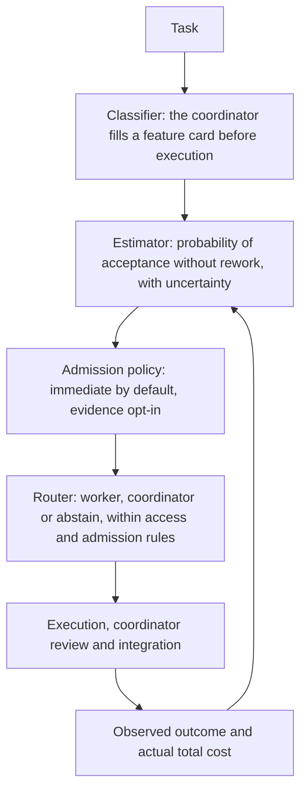

# Hybrid delegation routing

DeepSeek Team can combine a bounded prior from imported public results with outcomes observed in the current project. Auto defaults to immediate admission of eligible work; the evidence-driven bootstrap/adaptive/recovery policy is opt-in. It stores routing state privately for each project and records explainable decisions. It does not fine-tune a model, promise a benchmark score, or treat a public leaderboard percentage as the probability of success on your code.

Every command takes `--path PROJECT`. Commands return JSON so results can be inspected or passed to other tools. `status` reports the current state; `config --json` prints the effective routing configuration.

```bash
deepseek-team routing status --path /path/to/repository --json
deepseek-team routing config --path /path/to/repository --json
```

## Three responsibilities and one feedback loop

Routing is not a trained neural classifier and not a fixed delegation percentage. It has three responsibilities that cooperate, plus a loop that feeds observed results back into the next decision.



### Classifier — the coordinator, before execution

The frontier coordinator classifies each task itself, before any worker runs. It is not a separate neural model and not an automatic code-analysis classifier. A plan captures the classification as a structured feature card on the deliverable:

- `kind`, `domain` and `operation` define the comparable task family.
- `localization` (`known`/`partial`/`unknown`), `coupling` (`local`/`component`/`cross-component`/`unknown`), `risk`, `scope_size`, `clarity` and `verification` describe the known scope.
- `runtime`, `model`, `effort` and `context_version` identify the execution conditions, so results from one execution identity are not silently reused for another.

Unspecified task attributes such as domain, operation, risk and verification stay `unknown`; the coordinator should not guess them into certainty. Execution fields have documented defaults (`codex`, `deepseek-flash`, `medium`, context `default`), and a plan supplies its kind and runtime. The coordinator must check these against the actual assignment. A case whose task family is unknown cannot transfer evidence to another task. Protected work stays with the coordinator: architecture, security, integration, final verification, commit/push, production and secret signing.

### Estimator — acceptance without rework, with uncertainty

From comparable recorded cases the estimator produces the probability that a worker result is accepted without rework, together with the uncertainty around that probability. It does not predict a universal delegation percentage.

A case counts only when its known `kind`, `domain`, `operation` and its execution identity (`runtime`, `model`, `effort`, `context_version`) match. The remaining traits — `localization`, `coupling`, `verification`, `clarity`, `risk`, `scope_size` — contribute similarity weights, so more matches mean more weight. As enough comparable local outcomes accumulate, they can outweigh the capped imported evidence, and every observation loses weight as it ages, with the same half-life for successes and failures. A later failure for the same case dominates an earlier acceptance, and repeated attempts at one case do not become independent successes. `infrastructure`, `cancelled` and `unknown` outcomes carry no quality label.

The calculation uses two weighted counts: accepted worker results and quality failures. A Beta(1,1) prior starts the estimate without a preference for success or failure. Each comparable outcome adds weight to the appropriate count. The average estimate is `(1 + success weight) / (2 + success weight + failure weight)`; a probability interval expresses how much uncertainty remains. Few observations produce a broad interval, so one successful task is insufficient to establish reliability.

Public evidence enters only through explicit import: the operator supplies an HTTPS provenance URL and the SHA-256 of the exact bytes, and the estimate caps how much a single source family and all external sources together may contribute. No public scores are bundled or seeded, and no hook scrapes them in the background. This is passive statistics over recorded outcomes: there is no model fine-tuning and no paid learning job.

### Router — a conservative executor choice

The router turns the estimate into an executor choice. Its learned recommendation (separate from immediate assignment admission) applies these checks:

1. Permissions and protected responsibilities. Protected work, write tasks without `full-access`, and disabled routing stay with the coordinator.
2. A conservative quality bound: the lower end of the acceptance interval must clear `min_success_probability`, and there must be enough comparable local support.
3. Measured cost: the full worker total (execution plus coordinator review and rework) is compared with comparable coordinator observations. Missing evidence prevents a learned recommendation of measured savings, unless the cost gate was explicitly disabled with `--no-require-cost-evidence`.

The default quality threshold is 80% at the lower end of a 95% interval, with at least five effective local observations; similarity and age can make one observation count for less than one. The default cost gate requires at least 10% measured savings. These are configurable decision rules, not guarantees about the next task. Under the opt-in `evidence` policy, Auto can also admit bounded bootstrap, cost-learning or recovery assignments of safe ordinary tasks, as described below. Sufficient comparable cost evidence showing savings below the threshold blocks all such trials.

The ordinary recommendation is `worker`, `coordinator` or `abstain`. In `auto` mode a plan's `executor: auto` resolves to a concrete executor; an abstention leaves the task with the coordinator and records why. Explicit `worker` or `coordinator` choices are never overwritten, and saved manual `25`/`50`/`75` profiles keep priority while their outcomes keep feeding the same evidence. Fresh `delegation_level=auto, access=auto` settings resolve to `read-only`; worker writes require an explicit access grant.

### Feedback loop

After each assignment the coordinator records what actually happened: an observed outcome (`accepted` means accepted without rework; `rework` and `rejected` are quality failures; `infrastructure`, `cancelled` and `unknown` stay unlabelled) and the actual total cost. Those observed worker and coordinator results become the evidence for later estimates. The system compares real recorded outcomes; it does not estimate a counterfactual result for the executor that was not chosen.

At a cold start, `immediate` admits eligible bounded work without waiting for history. Quality and cost estimates keep updating; unknown cost never becomes claimed savings.

### A small example: known before execution vs observed later

Suppose the coordinator plans a small task: "add a `--quiet` flag to the `status` command and cover it with a unit test", to run in a full-access copy.

Facts known before execution, recorded in the feature card and unchanged by the result:

- `kind = implementation`, `domain = python`, `operation = extend`
- `localization = known`, `coupling = local`, `verification = tests`
- `clarity = clear`, `risk = low`, `scope_size = small`
- `runtime = codex`, `model = deepseek-flash`, `effort = medium`, `context_version = project-v1`

Observed only after the work, recorded through the coordination lifecycle:

- the outcome — for example `accepted` without rework, or `rework`/`rejected` if review found problems;
- the actual total cost, including the coordinator's review and any rework.

The feature card tells the estimator which cases are comparable before the task runs; the observed outcome is what actually changes later estimates. The card is never rewritten to match the result. See [Runnable synthetic example](#runnable-synthetic-example) for the JSON shape of both.

## Modes and executor selection

Fresh installations use `delegation_level="auto"`, routing mode `auto`, `admission_policy="immediate"`, and effective access `read-only`. Explicitly select `deepseek-team config set --project --access full-access` for implementation. Public imports never launch extra paid experiments.

An existing saved numeric delegation preference is not silently overwritten. The manual `25`, `50`, and `75` profiles remain available and their real worker outcomes continue to supply local evidence:

```bash
deepseek-team config set --project --path /path/to/repository --delegation-level 50
```

Routing modes are:

- `off` disables routing decisions.
- `shadow` records what the policy would recommend without changing executor selection.
- `advisory` returns a recommendation for the coordinator to review.
- `auto` may resolve an explicitly requested `executor: auto`. Existing plans with an explicit worker or coordinator keep their executor. If the policy abstains, the coordinator retains the task and the reason is recorded.

Automatic routing cannot widen the configured access level. Architecture, security, integration, final verification, commit/push, production, and secret-signing work remains coordinator-owned. Unknown or high risk and weak verification prevent automatic trial admission. Missing local history or costs do not block eligible assignments under `immediate`.

Configure only the values you want to change:

```bash
deepseek-team routing configure --path /path/to/repository \
  --mode advisory \
  --confidence 0.95 \
  --min-success-probability 0.80 \
  --min-local-evidence 5 \
  --external-weight-cap 5 \
  --source-weight-cap 2 \
  --half-life-days 90 \
  --max-evidence-age-days 365 \
  --min-similarity 0.60 \
  --minimum-savings-fraction 0.10 \
  --recovery-rate 0.10 \
  --recovery-cooldown-seconds 300 \
  --require-cost-evidence
```

Use `--no-require-cost-evidence` only when you intentionally want learned recommendations without measured cost comparisons. Confidence bounds and minimum evidence rules still apply to those recommendations. This option is not needed to enable bootstrap or cost learning.

## Immediate admission by default

**Auto delegates useful bounded work immediately by default** (`admission_policy=immediate`). Small or medium tasks with low or medium risk, known or partial localization, local or component coupling, clear requirements and declared tests or a reproducer can be assigned from the first session. Manual verification is allowed for read, review, research, diagnostic, test-plan and documentation tasks with explicit acceptance criteria. Implementation requires executable checks and `full-access`.

There is no cold-start history wait, three-assignment cap, periodic coordinator holdout or recovery stride. Unknown costs stay unknown and do not block eligible work; supported poor measured economics still veto delegation. One rework is recorded without a family pause. A rejection or three distinct rework cases within the cooldown window pause the family, by default for 300 seconds; saved cooldown values are respected. Immediate admission resumes after the pause without a trial quota. Failed implementation never retries automatically.

Fresh Auto access remains **read-only**. To delegate implementation, explicitly opt in:

```bash
deepseek-team config set --project --access full-access
```

The coordinator decomposes meaningful independent slices, reviews actual diffs and declared checks, and reports accepted work and rework without repeating the worker's investigation or inventing percentage savings. Architecture, security, integration, final verification, commits and production remain coordinator-owned. Saved manual profiles, explicit permissions and `off` retain priority. The previous bootstrap/adaptive/recovery policy is opt-in through `deepseek-team routing configure --admission-policy evidence`.

### Worker queue and parallel execution

Eligible assignments remain assigned to workers when execution slots are busy. Assignment is separate from execution: launches wait FIFO, with **8 concurrent workers by default**, configurable from 1 to 64. Each managed assignment needs an owned isolated copy; parallel work must be independent.

```bash
deepseek-team config set --project --max-workers 8
# Or save a user-wide limit:
deepseek-team config set --global --max-workers 8
# One-job override:
deepseek-team worker --runtime codex --max-workers 4
```

Default waiting and total timeout are unlimited. `worker --no-wait` returns capacity exit code `75` when no slot is available; explicit `--timeout` includes queue time. Before provider launch or credential access, queued work rechecks `off`, access, routing authorization and project HEAD. Waiting never widens permissions. The required OS sandbox, private network and fixed relay for managed copies are unchanged.


## Automatic stages under the evidence policy

This section applies only after explicitly choosing `deepseek-team routing configure --admission-policy evidence`. It retains the previous stages and trial limits; these do not apply to `immediate`.

When both the delegation profile and routing mode are `auto`, a plan's `executor: auto` can receive a bounded worker trial. Trials require a complete feature card: low risk, small scope, local coupling, known localization, clear requirements, verification through `tests` or a `reproducer`, and concrete registered checks. The task must also fit the configured access and the worker must be available. A standalone recommendation does not reserve or launch a trial.

The stage is determined separately for each `kind`, `domain`, `operation`, `runtime`, `model`, `effort` and `context_version`, using comparable evidence. A recorded decision includes its `phase` and the evidence behind that phase.

### Bootstrap: gather evidence from safe tasks

Without supported quality or material comparable local failures, eligible tasks can go to the worker immediately, subject to capacity and cooldown. Bootstrap has no recovery-style gap between assignments. Every tenth distinct eligible bootstrap opportunity in the same family and execution context stays with the coordinator to collect a real comparison outcome and, when available, measured total cost.

Bootstrap continues until **both** quality conditions hold: at least `min_local_evidence` effective local observations and an acceptance interval whose lower bound reaches `min_success_probability`. With the defaults, five successful cases alone do not establish an 80% lower bound at 95% confidence. Bootstrap therefore continues past the fifth success while uncertainty remains.

### Adaptive: use supported quality and measured economics

Once quality is supported, learned recommendations use the conservative cost gate. When cost evidence is still insufficient, the same safe task criteria permit bounded cost-learning assignments, sharing bootstrap capacity and its coordinator comparison schedule. Missing costs remain unknown; no savings are fabricated. Record actual worker totals including review and rework, and actual coordinator totals, when they can be measured.

Sufficient comparable cost evidence for both executors can veto every trial if measured savings fall below `minimum_savings_fraction`. Cost support requires at least `max(1, min_local_evidence)` effective cost observations for each executor. Good quality alone does not override known poor economics.

### Recovery: gather evidence cautiously after quality failures

If quality is unsupported and comparable local worker failures contribute at least `0.5` effective cases after similarity and age weighting, the stage becomes recovery. A recorded worker quality failure can pause the affected family even when it came from an ordinary or explicitly selected assignment. During the cooldown, Auto retains the coordinator for that family.

After the cooldown, the first eligible recovery case can be selected. Subsequent recovery admissions require `ceil(1 / recovery_rate)` distinct eligible recovery opportunities since the last selection across the project. The default rate is `0.10`, giving a gap of ten opportunities; the allowed range is `0` through `0.25`. Zero disables recovery admissions, without disabling bootstrap. Successes and failures lose weight at the same rate, so the stage can change as evidence ages. Retrying one case never turns its first quality failure into a clean success. Provider failures, infrastructure failures and cancellations remain neutral for quality.

### Shared trial limits and lifecycle

At most **three bootstrap or recovery tickets combined** may be pending or running across the project. At most **one** of those may be a recovery ticket. Cost-learning assignments use bootstrap admission and share these limits. This cap covers bounded trials; the worker runner separately enforces its concurrency limit.

An unused pending ticket expires after one hour. Running tickets never expire automatically and are never automatically retried. A worker quality failure starts `recovery_cooldown_seconds` for the same family and execution context; the saved setting is respected and the new default is 300 seconds and the allowed range is `0` through `2592000` seconds. A running assignment must be inspected and dispositioned through the normal coordination flow.

The existing recovery status command covers both admission types. It reports each ticket's `admission` (`bootstrap` or `recovery`), bootstrap pending/running counts, the active recovery count, and the shared limit. A cost-learning decision in the adaptive stage has `phase: adaptive`; its ticket reports `admission: bootstrap`.

```bash
deepseek-team routing recovery status --path /path/to/repository
# Release only an unused pending ticket:
deepseek-team routing recovery release RECOVERY_ID --path /path/to/repository
```

If the coordinator process is lost after an assignment starts, inspect the retained worker diff and workspace first. Find and stop any remaining worker OS processes, then verify that they are stopped. Only then explicitly abandon the orphaned running assignment with concrete evidence:

```bash
deepseek-team coordination abandon \
  --path /path/to/repository \
  --task TASK_ID \
  --assignment ASSIGNMENT_ID \
  --evidence "Inspected retained diff; stopped and verified the worker process group" \
  --confirmed-stopped
```

`--confirmed-stopped` is an operator attestation, not a request for DeepSeek Team to kill processes. The command requires a running assignment and also verifies through an exclusive workspace lock that no active owner remains. It refuses a currently owned live workspace. Successful abandonment records `cancelled`, contributes no quality failure, and resolves its trial ticket. There is no automatic abandonment timeout, retry, or process killing.

Recorded plan decisions are canonical for their task, deliverable and plan binding: repeated evaluation reuses the saved decision rather than consuming another opportunity or trying again for a worker assignment. Access or policy revocation may narrow an existing authorization; it never promotes a denied or expired trial into a new one.

The stages never override explicit worker or coordinator choices, the manual `25`, `50`, or `75` profiles, routing mode, access, eligibility, or worker availability. They do not guarantee a delegation rate for every task. Bootstrap, cost-learning and recovery assignments are normal project tasks with the same review and outcome requirements as other delegated work. They are not extra paid benchmark reruns and do not consume the experiment-budget ledger.

## Runnable synthetic example

The following snapshot is deliberately synthetic. It demonstrates the import format and must not be presented as a real benchmark or a claim about either executor.

```bash
PROJECT=/path/to/repository
NOW=$(date +%s)
cat > /tmp/deepseek-routing-example.json <<JSON
{
  "schema_version": 1,
  "format": "deepseek-team-evidence",
  "source_family": "synthetic-documentation-example",
  "observations": [
    {
      "id": "synthetic-public-observation-1",
      "case_id": "synthetic-public-case-1",
      "source_family": "synthetic-documentation-example",
      "features": {
        "kind": "implementation",
        "domain": "python",
        "operation": "extend",
        "localization": "known",
        "coupling": "local",
        "verification": "tests",
        "clarity": "clear",
        "risk": "low",
        "scope_size": "small",
        "runtime": "codex",
        "model": "deepseek-flash",
        "effort": "medium",
        "context_version": "example-v1"
      },
      "action": "worker",
      "outcome": "accepted",
      "observed_at": $NOW,
      "cost_usd": 0.04,
      "duration_seconds": 42
    }
  ]
}
JSON
SHA=$(sha256sum /tmp/deepseek-routing-example.json | cut -d' ' -f1)
deepseek-team routing import /tmp/deepseek-routing-example.json \
  --path "$PROJECT" \
  --source-id synthetic-doc-v1 \
  --source-url https://example.org/deepseek-routing-example.json \
  --sha256 "$SHA" \
  --reliability 0.2
```

Imported public evidence remains external evidence. Reliability, similarity, freshness, source-family caps, and a total external cap bound its influence; imported volume cannot silently become project experience.

Ask for a recommendation with a feature card. The model, runtime, effort, and context version identify the candidate worker conditions and prevent evidence from silently crossing execution identities.

```bash
cat > /tmp/feature-card.json <<'JSON'
{
  "kind": "implementation",
  "domain": "python",
  "operation": "extend",
  "localization": "known",
  "coupling": "local",
  "verification": "tests",
  "clarity": "clear",
  "risk": "low",
  "scope_size": "small",
  "runtime": "codex",
  "model": "deepseek-flash",
  "effort": "medium",
  "context_version": "example-v1"
}
JSON
deepseek-team routing recommend --path "$PROJECT" --file /tmp/feature-card.json --access read-only
```

A single synthetic external result is intentionally inadequate evidence for confident automatic routing. The response includes the action, reason codes, posterior uncertainty, and available economics. New models or context versions begin uncertain.

After a real project assignment reaches its first meaningful outcome, record what actually happened. `accepted` means final acceptance without rework; `rework` and `rejected` are failures. `infrastructure`, `cancelled`, and `unknown` remain unlabelled. `cost_usd` is total measured cost, including worker execution plus review and rework. Never invent the unchosen executor's result or cost.

```bash
NOW=$(date +%s)
cat > /tmp/local-observation.json <<JSON
{
  "id": "local-observation-1",
  "case_id": "project-case-1",
  "origin": "local",
  "features": {
    "kind": "implementation",
    "domain": "python",
    "operation": "extend",
    "localization": "known",
    "coupling": "local",
    "verification": "tests",
    "clarity": "clear",
    "risk": "low",
    "scope_size": "small",
    "runtime": "codex",
    "model": "deepseek-flash",
    "effort": "medium",
    "context_version": "example-v1"
  },
  "action": "worker",
  "outcome": "accepted",
  "observed_at": $NOW,
  "cost_usd": 0.06,
  "duration_seconds": 75
}
JSON
deepseek-team routing observe --path "$PROJECT" --file /tmp/local-observation.json
```

Normal coordinated work should record its verified result through the coordination commands. `--cost-usd` is the full measured total, including execution, coordinator review, and any rework:

```bash
deepseek-team coordination use --path "$PROJECT" \
  --task TASK_ID --assignment ASSIGNMENT_ID \
  --disposition incorporated --evidence "Declared checks and review passed" \
  --cost-usd 0.06

deepseek-team coordination result --path "$PROJECT" \
  --task TASK_ID --deliverable DELIVERABLE_ID \
  --outcome accepted --evidence "Declared checks and final review passed" \
  --cost-usd 0.40
```

Coordinator outcomes accept `accepted`, `rework`, `rejected`, `infrastructure`, `cancelled`, or `unknown`. For a coordinator observation, the feature card still describes the candidate worker identity so comparable worker and coordinator observations can be evaluated.

The lower-level `routing observe` command is for trusted operator-reported historical data. Without a valid recorded decision ID it cannot guarantee that the feature card was captured before execution, so do not use it as a substitute for the coordination lifecycle when that lifecycle is available. Corrections for a local case are chronological and immutable: every phase remains in the audit history, and any observed `rework` or `rejected` quality failure dominates an earlier or later `accepted` phase. Repeated attempts at one case do not become independent evidence.

## Import, fetch, evaluation, and export

`import` reads local bytes and never accesses the network. It requires an HTTPS provenance URL and the SHA-256 of the exact bytes. Network access occurs only with the explicit `fetch` command, which also requires a pinned digest and rejects unsafe destinations:

```bash
deepseek-team routing fetch https://data.example.org/run.json \
  --path /path/to/repository \
  --source-id public-run-2026-09 \
  --sha256 0123456789abcdef0123456789abcdef0123456789abcdef0123456789abcdef \
  --reliability 0.5
```

Evaluate cases chronologically: each prediction is scored before that case's outcome is learned, and repeated case IDs are grouped. A retrospective correction preserves the original forecast; evaluation learns the correction only when its timestamp is reached.

```bash
deepseek-team routing evaluate --path /path/to/repository
deepseek-team routing export --path /path/to/repository --output /tmp/routing-export.json
```

`export` streams the existing JSON export format instead of loading the full project history into memory. Without `--output` it writes that JSON directly to stdout. File output is written privately and replaced atomically, so an interrupted export does not replace an existing valid file. Export is a local read operation: it does not run a worker, contact a model provider, or start a paid action.

Evaluation reports Brier score, log loss, calibration, coverage, and observed policy outcomes when available. These are conditional summaries of recorded outcomes. They do not establish formal correctness or counterfactual savings.

## Experiment budgets

Reservations are explicit, persistent, atomic, and idempotent. They govern the amount authorized for a manually requested extra experiment under per-run and monthly settings. Routing never launches extra paid experiments automatically. The ledger does not apply to normal project jobs, including bootstrap, cost-learning and recovery assignments. Reservations are accounting controls inside DeepSeek Team, not a provider billing limit, and they cannot guarantee a hard dollar cap. A settlement overrun prevents further experiment reservations; no automatic worker retry is performed.

```bash
deepseek-team routing configure --path /path/to/repository \
  --monthly-experiment-budget-usd 10 --per-experiment-limit-usd 2
deepseek-team routing budget reserve trial-2026-09-22 --path /path/to/repository --amount-usd 1.50
deepseek-team routing budget settle trial-2026-09-22 --path /path/to/repository --actual-usd 1.35
# Or release an unused reservation:
deepseek-team routing budget release trial-2026-09-22 --path /path/to/repository
```
