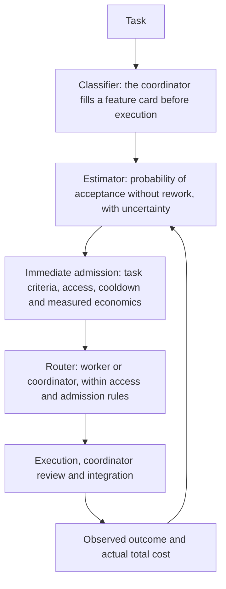

# Hybrid delegation routing

**English** | [Русский](https://github.com/kirill31337/deepseek-team/blob/main/docs/ROUTING.ru.md)

DeepSeek Team can combine a bounded prior from imported public results with outcomes observed in the current project. Auto immediately admits eligible work while keeping statistical uncertainty visible. It stores routing state privately for each project and records explainable decisions. It does not fine-tune a model, promise a benchmark score, or treat a public leaderboard percentage as the probability of success on your code.

Every command takes `--path PROJECT`. Commands return JSON so results can be inspected or passed to other tools. `status` reports the current state; `config --json` prints the effective routing configuration.

```bash
deepseek-team routing status --path /path/to/repository --json
deepseek-team routing config --path /path/to/repository --json
```

## Three responsibilities and one feedback loop

Routing is not a trained neural classifier and not a fixed delegation percentage. It has three responsibilities that cooperate, plus a loop that feeds observed results back into the next decision.



### Classifier — the coordinator, before execution

The frontier coordinator classifies each task itself, before any worker runs. It is not a separate neural model and not an automatic code-analysis classifier. A plan captures the classification as a structured feature card on the deliverable:

- `kind`, `domain` and `operation` define the comparable task family.
- `localization` (`known`/`partial`/`unknown`), `coupling` (`local`/`component`/`cross-component`/`unknown`), `risk`, `scope_size`, `clarity` and `verification` describe the known scope.
- `runtime`, `model`, `effort` and `context_version` identify the execution conditions, so results from one execution identity are not silently reused for another.

Unspecified task attributes such as domain, operation, risk and verification stay `unknown`; the coordinator should not guess them into certainty. Execution fields have documented defaults (`codex`, `deepseek-flash`, `medium`, context `default`), and a plan supplies its kind and runtime. The coordinator must check these against the actual assignment. A case whose task family is unknown cannot transfer evidence to another task. Protected work stays with the coordinator: architecture, security, integration, final verification, commit/push, production and secret signing.

### Estimator — acceptance without rework, with uncertainty

From comparable recorded cases the estimator produces the probability that a worker result is accepted without rework, together with the uncertainty around that probability. It does not predict a universal delegation percentage.

A case counts only when its known `kind`, `domain`, `operation` and its execution identity (`runtime`, `model`, `effort`, `context_version`) match. The remaining traits — `localization`, `coupling`, `verification`, `clarity`, `risk`, `scope_size` — contribute similarity weights, so more matches mean more weight. As enough comparable local outcomes accumulate, they can outweigh the capped imported evidence, and every observation loses weight as it ages, with the same half-life for successes and failures. A later failure for the same case dominates an earlier acceptance, and repeated attempts at one case do not become independent successes. `infrastructure`, `cancelled` and `unknown` outcomes carry no quality label.

The calculation uses two weighted counts: accepted worker results and quality failures. A Beta(1,1) prior starts the estimate without a preference for success or failure. Each comparable outcome adds weight to the appropriate count. The average estimate is `(1 + success weight) / (2 + success weight + failure weight)`; a probability interval expresses how much uncertainty remains. Few observations produce a broad interval, so one successful task is insufficient to establish reliability.

Public evidence enters only through explicit import: the operator supplies an HTTPS provenance URL and the SHA-256 of the exact bytes, and the estimate caps how much a single source family and all external sources together may contribute. No public scores are bundled or seeded, and no hook scrapes them in the background. This is passive statistics over recorded outcomes: there is no model fine-tuning and no paid learning job.

### Router — immediate executor choice

Recommendations and assignments use one admission path. The router checks permissions, protected responsibilities, task features, active family cooldowns and supported poor measured economics. Eligible work receives `worker`; other work receives `coordinator` with a recorded reason. Missing quality history or prices do not prevent an eligible assignment. The acceptance estimate, uncertainty and available economics remain visible; they do not guarantee quality or savings.

The economic veto needs comparable measured total costs for both executors, with effective cost support of at least `max(1, min_local_evidence)` each. Measured savings below `minimum_savings_fraction` (10% by default) block admission. Missing costs remain unknown.

In `auto` mode, a plan's `executor: auto` resolves to a concrete executor. Explicit choices and saved manual `25`/`50`/`75` profiles retain priority. Fresh `delegation_level=auto, access=auto` settings resolve to read-only; worker writes need explicit access.

### Feedback loop

After each assignment the coordinator records what actually happened: an observed outcome (`accepted` means accepted without rework; `rework` and `rejected` are quality failures; `infrastructure`, `cancelled` and `unknown` stay unlabelled) and the actual total cost. Those observed worker and coordinator results become the evidence for later estimates. The system compares real recorded outcomes; it does not estimate a counterfactual result for the executor that was not chosen.

At a cold start, immediate admission allows eligible bounded work without waiting for history. Quality and cost estimates keep updating; unknown cost never becomes claimed savings.

### A small example: known before execution vs observed later

Suppose the coordinator plans a small task: "add a `--quiet` flag to the `status` command and cover it with a unit test", to run in a full-access copy.

Facts known before execution, recorded in the feature card and unchanged by the result:

- `kind = implementation`, `domain = python`, `operation = extend`
- `localization = known`, `coupling = local`, `verification = tests`
- `clarity = clear`, `risk = low`, `scope_size = small`
- `runtime = codex`, `model = deepseek-flash`, `effort = medium`, `context_version = project-v1`

Observed only after the work, recorded through the coordination lifecycle:

- the outcome — for example `accepted` without rework, or `rework`/`rejected` if review found problems;
- the actual total cost, including the coordinator's review and any rework.

The feature card tells the estimator which cases are comparable before the task runs; the observed outcome is what actually changes later estimates. The card is never rewritten to match the result. See [Runnable synthetic example](#runnable-synthetic-example) for the JSON shape of both.

## Modes and executor selection

Fresh installations use `delegation_level="auto"`, routing mode `auto`, and effective access `read-only`. Explicitly select `deepseek-team config set --project --access full-access` for implementation. Public imports never launch extra paid experiments.

An existing saved numeric delegation preference is not silently overwritten. The manual `25`, `50`, and `75` profiles remain available and their real worker outcomes continue to supply local evidence:

```bash
deepseek-team config set --project --path /path/to/repository --delegation-level 50
```

Routing modes are:

- `off` disables routing decisions.
- `shadow` records what the policy would recommend without changing executor selection.
- `advisory` returns a recommendation for the coordinator to review.
- `auto` may resolve an explicitly requested `executor: auto`. Existing plans with an explicit worker or coordinator keep their executor. Ineligible work stays with the coordinator and the reason is recorded.

Automatic routing cannot widen the configured access level. Architecture, security, integration, final verification, commit/push, production, and secret-signing work remains coordinator-owned. Unknown or high risk and weak verification prevent automatic admission. Missing local history or costs do not block eligible assignments.

Configure only the values you want to change:

```bash
deepseek-team routing configure --path /path/to/repository \
  --mode advisory \
  --confidence 0.95 \
  --min-local-evidence 5 \
  --external-weight-cap 5 \
  --source-weight-cap 2 \
  --half-life-days 90 \
  --max-evidence-age-days 365 \
  --min-similarity 0.60 \
  --minimum-savings-fraction 0.10 \
  --failure-cooldown-seconds 300
```

Missing quality and cost evidence do not delay an eligible task. Estimator settings control statistics and their interpretation, without imposing a minimum quality history before the first assignment.

## Immediate admission by default

**Auto delegates useful bounded work immediately by default**. Small or medium tasks with low or medium risk, known or partial localization, local or component coupling, clear requirements and declared tests or a reproducer can be assigned from the first session. Manual verification is allowed for read, review, research, diagnostic, test-plan and documentation tasks with explicit acceptance criteria. Implementation requires executable checks and `full-access`.

Unknown costs stay unknown and do not block eligible work; supported poor measured economics still veto delegation. One rework is recorded without a family pause. A rejection or three distinct rework cases within the cooldown window pause the family for the configured `failure_cooldown_seconds` (300 seconds by default). Immediate admission resumes after the pause. Failed implementation never retries automatically.

Fresh Auto access remains **read-only**. To delegate implementation, explicitly opt in:

```bash
deepseek-team config set --project --access full-access
```

The coordinator decomposes meaningful independent slices, reviews actual diffs and declared checks, and reports accepted work and rework without repeating the worker's investigation or inventing percentage savings. Architecture, security, integration, final verification, commits and production remain coordinator-owned. Saved manual profiles, explicit permissions and `off` retain priority.

### Worker queue and parallel execution

Eligible assignments remain assigned to workers when execution slots are busy. Assignment is separate from execution: launches wait FIFO, with **8 concurrent workers by default**, configurable from 1 to 64. Each managed assignment needs an owned isolated copy; parallel work must be independent.

```bash
deepseek-team config set --project --max-workers 8
# Or save a user-wide limit:
deepseek-team config set --global --max-workers 8
# One-job override:
deepseek-team worker --runtime codex --max-workers 4
```

Default waiting and total timeout are unlimited. `worker --no-wait` returns capacity exit code `75` when no slot is available; explicit `--timeout` includes queue time. Before provider launch or credential access, queued work rechecks `off`, access, routing authorization and project HEAD. Waiting never widens permissions. The required OS sandbox, private network and fixed relay for managed copies are unchanged.


## Admission state and assignment lifecycle

`deepseek-team routing status --path /path/to/repository --json` reports active family pauses in `admission.active_cooldowns`. `failure_cooldown_seconds` accepts 0 through 2592000 seconds and defaults to 300.

Routing state uses format 3 in `routing-v3.sqlite3`, stored privately per project outside Git. The package does not read or migrate older databases; their files remain untouched. An unsupported version in the current database is rejected. External import snapshots use a separate format contract, shown below.

If the coordinator process is lost after an assignment starts, inspect the retained worker diff and workspace first. Find and stop any remaining worker OS processes, then verify that they are stopped. Only then explicitly abandon the orphaned running assignment with concrete evidence:

```bash
deepseek-team coordination abandon \
  --path /path/to/repository \
  --task TASK_ID \
  --assignment ASSIGNMENT_ID \
  --evidence "Inspected retained diff; stopped and verified the worker process group" \
  --confirmed-stopped
```

`--confirmed-stopped` is an operator attestation, not a request for DeepSeek Team to kill processes. The command requires a running assignment and also verifies through an exclusive workspace lock that no active owner remains. It refuses a currently owned live workspace. Successful abandonment records `cancelled`, contributes no quality failure, and resolves the assignment cancellation. There is no automatic abandonment timeout, retry, or process killing.

Recorded plan decisions are canonical for their task, deliverable and plan binding: repeated evaluation reuses the saved decision without selecting the executor again. Access or policy revocation may narrow an existing authorization; it never promotes a denied assignment into a new one.

## Runnable synthetic example

The following snapshot is deliberately synthetic. It demonstrates the import format and must not be presented as a real benchmark or a claim about either executor.

```bash
PROJECT=/path/to/repository
NOW=$(date +%s)
cat > /tmp/deepseek-routing-example.json <<JSON
{
  "schema_version": 1,
  "format": "deepseek-team-evidence",
  "source_family": "synthetic-documentation-example",
  "observations": [
    {
      "id": "synthetic-public-observation-1",
      "case_id": "synthetic-public-case-1",
      "source_family": "synthetic-documentation-example",
      "features": {
        "kind": "implementation",
        "domain": "python",
        "operation": "extend",
        "localization": "known",
        "coupling": "local",
        "verification": "tests",
        "clarity": "clear",
        "risk": "low",
        "scope_size": "small",
        "runtime": "codex",
        "model": "deepseek-flash",
        "effort": "medium",
        "context_version": "example-v1"
      },
      "action": "worker",
      "outcome": "accepted",
      "observed_at": $NOW,
      "cost_usd": 0.04,
      "duration_seconds": 42
    }
  ]
}
JSON
SHA=$(sha256sum /tmp/deepseek-routing-example.json | cut -d' ' -f1)
deepseek-team routing import /tmp/deepseek-routing-example.json \
  --path "$PROJECT" \
  --source-id synthetic-doc-v1 \
  --source-url https://example.org/deepseek-routing-example.json \
  --sha256 "$SHA" \
  --reliability 0.2
```

Imported public evidence remains external evidence. Reliability, similarity, freshness, source-family caps, and a total external cap bound its influence; imported volume cannot silently become project experience.

Ask for a recommendation with a feature card. The model, runtime, effort, and context version identify the candidate worker conditions and prevent evidence from silently crossing execution identities.

```bash
cat > /tmp/feature-card.json <<'JSON'
{
  "kind": "implementation",
  "domain": "python",
  "operation": "extend",
  "localization": "known",
  "coupling": "local",
  "verification": "tests",
  "clarity": "clear",
  "risk": "low",
  "scope_size": "small",
  "runtime": "codex",
  "model": "deepseek-flash",
  "effort": "medium",
  "context_version": "example-v1"
}
JSON
deepseek-team routing recommend --path "$PROJECT" --file /tmp/feature-card.json --access read-only
```

A single synthetic external result does not establish reliability. Eligible work can still be assigned while statistical uncertainty remains high. The response includes the action, reason codes, posterior uncertainty, and available economics. New models or context versions begin uncertain.

After a real project assignment reaches its first meaningful outcome, record what actually happened. `accepted` means final acceptance without rework; `rework` and `rejected` are failures. `infrastructure`, `cancelled`, and `unknown` remain unlabelled. `cost_usd` is total measured cost, including worker execution plus review and rework. Never invent the unchosen executor's result or cost.

```bash
NOW=$(date +%s)
cat > /tmp/local-observation.json <<JSON
{
  "id": "local-observation-1",
  "case_id": "project-case-1",
  "origin": "local",
  "features": {
    "kind": "implementation",
    "domain": "python",
    "operation": "extend",
    "localization": "known",
    "coupling": "local",
    "verification": "tests",
    "clarity": "clear",
    "risk": "low",
    "scope_size": "small",
    "runtime": "codex",
    "model": "deepseek-flash",
    "effort": "medium",
    "context_version": "example-v1"
  },
  "action": "worker",
  "outcome": "accepted",
  "observed_at": $NOW,
  "cost_usd": 0.06,
  "duration_seconds": 75
}
JSON
deepseek-team routing observe --path "$PROJECT" --file /tmp/local-observation.json
```

Normal coordinated work should record its verified result through the coordination commands. `--cost-usd` is the full measured total, including execution, coordinator review, and any rework:

```bash
deepseek-team coordination use --path "$PROJECT" \
  --task TASK_ID --assignment ASSIGNMENT_ID \
  --disposition incorporated --evidence "Declared checks and review passed" \
  --cost-usd 0.06

deepseek-team coordination result --path "$PROJECT" \
  --task TASK_ID --deliverable DELIVERABLE_ID \
  --outcome accepted --evidence "Declared checks and final review passed" \
  --cost-usd 0.40
```

Coordinator outcomes accept `accepted`, `rework`, `rejected`, `infrastructure`, `cancelled`, or `unknown`. For a coordinator observation, the feature card still describes the candidate worker identity so comparable worker and coordinator observations can be evaluated.

The lower-level `routing observe` command is for trusted operator-reported historical data. Without a valid recorded decision ID it cannot guarantee that the feature card was captured before execution, so do not use it as a substitute for the coordination lifecycle when that lifecycle is available. Corrections for a local case are chronological and immutable: every phase remains in the audit history, and any observed `rework` or `rejected` quality failure dominates an earlier or later `accepted` phase. Repeated attempts at one case do not become independent evidence.

## Import, fetch, evaluation, and export

`import` reads local bytes and never accesses the network. It requires an HTTPS provenance URL and the SHA-256 of the exact bytes. Network access occurs only with the explicit `fetch` command, which also requires a pinned digest and rejects unsafe destinations:

```bash
deepseek-team routing fetch https://data.example.org/run.json \
  --path /path/to/repository \
  --source-id public-run-2026-09 \
  --sha256 0123456789abcdef0123456789abcdef0123456789abcdef0123456789abcdef \
  --reliability 0.5
```

Evaluate cases chronologically: each prediction is scored before that case's outcome is learned, and repeated case IDs are grouped. A retrospective correction preserves the original forecast; evaluation learns the correction only when its timestamp is reached.

```bash
deepseek-team routing evaluate --path /path/to/repository
deepseek-team routing export --path /path/to/repository --output /tmp/routing-export.json
```

`export` streams the current schema-version-3 JSON export format instead of loading the full project history into memory. Without `--output` it writes that JSON directly to stdout. File output is written privately and replaced atomically, so an interrupted export does not replace an existing valid file. Export is a local read operation: it does not run a worker, contact a model provider, or start a paid action.

Evaluation reports chronological calibration, Brier score and log loss, together with factual recorded outcomes and measured costs when available. Predictions describe acceptance probability and uncertainty; they do not choose an executor or score a delegation policy. These summaries do not establish formal correctness or counterfactual savings.

## Experiment budgets

Reservations are explicit, persistent, atomic, and idempotent. They govern the amount authorized for a manually requested extra experiment under per-run and monthly settings. Routing never launches extra paid experiments automatically. The ledger does not apply to normal project jobs, including automatically assigned work. Reservations are accounting controls inside DeepSeek Team, not a provider billing limit, and they cannot guarantee a hard dollar cap. A settlement overrun prevents further experiment reservations; no automatic worker retry is performed.

```bash
deepseek-team routing configure --path /path/to/repository \
  --monthly-experiment-budget-usd 10 --per-experiment-limit-usd 2
deepseek-team routing budget reserve experiment-2026-09-23 --path /path/to/repository --amount-usd 1.50
deepseek-team routing budget settle experiment-2026-09-23 --path /path/to/repository --actual-usd 1.35
# Or release an unused reservation:
deepseek-team routing budget release experiment-2026-09-23 --path /path/to/repository
```
