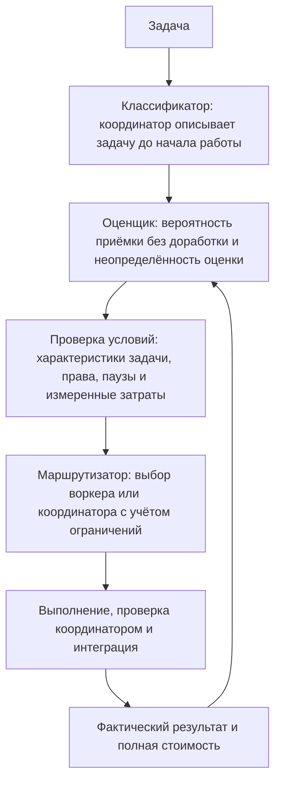

<a id="гибридная-маршрутизация-делегирования"></a>

# Как DeepSeek Team выбирает исполнителя

[English](https://github.com/kirill31337/deepseek-team/blob/main/docs/ROUTING.md) | **Русский**

При выборе исполнителя DeepSeek Team может учитывать результаты из двух источников: импортированных публичных отчётов и истории вашего проекта. Влияние публичных данных ограничено: они помогают сформировать предварительную оценку, но не заменяют опыт работы с вашим кодом.

В режиме Auto подходящие задачи можно передавать воркерам сразу, даже если статистики ещё мало. При этом система показывает, насколько неопределённа её оценка. История хранится отдельно для каждого проекта в закрытом каталоге; решения и причины выбора сохраняются. DeepSeek Team не дообучает модель, не обещает повторить результаты бенчмарков и не принимает процент из публичного рейтинга за вероятность успеха на вашем коде.

Все команды принимают `--path PROJECT` и возвращают JSON, который можно изучить или передать другим инструментам. Команда `status` показывает текущее состояние, а `config --json` — действующие настройки маршрутизации.

```bash
deepseek-team routing status --path /path/to/repository --json
deepseek-team routing config --path /path/to/repository --json
```

<a id="три-обязанности-и-один-цикл-обратной-связи"></a>

## Как устроен выбор исполнителя

В выборе исполнителя участвуют три части: координатор описывает задачу, оценщик рассчитывает вероятность приёмки, а маршрутизатор решает, кому поручить работу. После проверки результат пополняет статистику для следующих решений. Отдельной обученной нейросети для классификации задач здесь нет, как нет и фиксированного процента работы, который всегда передаётся воркерам.



<a id="классификатор--это-координатор-и-он-работает-до-исполнения"></a>

### Координатор описывает задачу до начала работы

До запуска воркера координатор описывает задачу, а план сохраняет это описание в карточке признаков. Для этого не нужны отдельная нейросеть или автоматический анализатор кода. В карточке указываются:

- `kind`, `domain` и `operation` — вид работы, область и операция. Например: реализация, Python, исправление ошибки.
- `localization` и `coupling` — насколько точно известно место изменений и как оно связано с остальным кодом. `risk` и `scope_size` описывают риск и размер задачи, `clarity` и `verification` — ясность требований и способ проверки.
- `runtime`, `model`, `effort` и `context_version` — среда запуска, модель, глубина рассуждений и версия контекста. По этим полям система различает условия, в которых работал воркер: результаты разных условий не смешиваются.

Если характеристика задачи неизвестна, для неё сохраняется `unknown`. Это касается, например, области, операции, риска и способа проверки. Недостающие сведения нельзя придумывать, чтобы оценка выглядела увереннее.

У условий запуска есть значения по умолчанию: `codex`, `deepseek-flash`, `high` и контекст `default`. Параметр `effort` принимает уровни `low`/`high`/`max`; старое значение `medium` считается синонимом `high`. Вид работы и среда запуска берутся из плана. Координатор должен проверить, что карточка соответствует реальному заданию. Если неизвестно, к какому типу относится задача, её результат не используют для оценки других задач.

Архитектура, решения по безопасности, интеграция, итоговая проверка, коммиты и push, действия в боевых системах, секреты и подпись всегда остаются за координатором.

<a id="оценщик--принятие-без-доработки-и-неопределённость"></a>

### Оценщик рассчитывает вероятность приёмки без доработки

Оценщик использует историю сопоставимых задач, чтобы рассчитать вероятность приёмки результата воркера без доработки. Вместе с вероятностью он показывает неопределённость оценки. Долю работы, которую следует делегировать, оценщик не определяет.

Результат прошлой задачи учитывается, только если совпадают известные значения `kind`, `domain`, `operation` и все условия запуска: `runtime`, `model`, `effort`, `context_version`. Остальные признаки — `localization`, `coupling`, `verification`, `clarity`, `risk`, `scope_size` — определяют степень сходства и вес результата в расчёте. Чем больше совпадений, тем выше вес.

Когда в проекте накапливается достаточно сопоставимых результатов, их совокупный вес может превысить ограниченный вес внешних данных. Со временем вес каждого результата уменьшается. Период полураспада — время, за которое вес сокращается вдвое, — одинаков для успехов и неудач.

Если после приёмки в той же задаче зафиксирована ошибка качества, она имеет приоритет над прежней приёмкой. Повторные попытки выполнить одну задачу не считаются независимыми успехами. Результаты `infrastructure`, `cancelled` и `unknown` не относятся ни к успехам, ни к ошибкам качества.

Для расчёта суммируются веса принятых результатов воркера и веса ошибок качества. В качестве начального, или априорного, распределения используется Beta(1,1): оно не отдаёт предпочтения ни успеху, ни неудаче. Каждый сопоставимый результат увеличивает соответствующую сумму весов.

Средняя оценка равна `(1 + вес успехов) / (2 + вес успехов + вес ошибок)`. Вероятностный интервал показывает, насколько неопределённой остаётся оценка. Если наблюдений мало, интервал широкий: одной успешно выполненной задачи недостаточно, чтобы судить о надёжности воркера.

Публичные данные учитываются только после явного импорта. Оператор указывает HTTPS-адрес источника и SHA-256, рассчитанный по содержимому импортируемого файла. Система ограничивает как вклад каждого семейства источников, так и общий вклад внешних данных.

В пакет не включены готовые оценки бенчмарков, а хуки не собирают их в фоне. Здесь обучение означает лишь обновление статистики по записанным результатам. Модель не дообучается, и платные задания специально ради накопления статистики не запускаются.

<a id="маршрутизатор--немедленный-выбор-исполнителя"></a>

### Маршрутизатор выбирает исполнителя

При выдаче рекомендации и при назначении задания действуют одни и те же проверки. Маршрутизатор учитывает права, обязанности координатора, характеристики задачи, временные паузы для похожих задач и данные о затратах. Если все условия выполнены, выбирается `worker`; иначе — `coordinator`, с сохранением причины.

Отсутствие истории качества или сведений о стоимости не препятствует передаче подходящей задачи. Вероятность приёмки, неопределённость оценки и известные затраты показываются в результате решения, но не гарантируют ни качество, ни экономию.

Отказ из-за затрат возможен только при наличии сопоставимых измерений полной стоимости работы и воркера, и координатора. Для каждого из них сумма весов данных о стоимости должна быть не меньше `max(1, min_local_evidence)`. Если по этим измерениям экономия ниже `minimum_savings_fraction` (по умолчанию 10 %), задача не передаётся воркеру. Неизвестную стоимость система не подменяет оценкой.

В режиме `auto` маршрутизатор заменяет `executor: auto` в плане конкретным исполнителем. Явно выбранный исполнитель и сохранённые ручные профили `25`/`50`/`75` имеют приоритет. После установки сочетание `delegation_level=auto, access=auto` даёт доступ только на чтение. Для записи нужно отдельное разрешение.

### Цикл обратной связи

После выполнения задания координатор записывает его фактический результат и полную стоимость. Метка `accepted` означает приёмку без доработки; `rework` и `rejected` означают ошибки качества. Результаты `infrastructure`, `cancelled` и `unknown` не получают оценки качества.

Записи о работе воркеров и координатора используются при следующих расчётах. Система сравнивает только реальные результаты. Она не придумывает, как справился бы с той же задачей другой исполнитель и сколько это стоило бы.

Если проект только начал пользоваться маршрутизацией и истории ещё нет, подходящие задачи всё равно можно сразу передавать воркерам. По мере работы оценки качества и затрат обновляются. Неизвестные затраты при этом не дают оснований заявлять об экономии.

<a id="небольшой-пример-что-известно-до-исполнения-и-что-наблюдается-позже"></a>

### Пример: сведения до начала работы и результат проверки

Допустим, координатор собирается поручить воркеру небольшую задачу: добавить флаг `--quiet` к команде `status` и проверить его модульным тестом. Работа будет выполняться в копии проекта с доступом `full-access`.

До начала работы координатор сохраняет в карточке следующие сведения. Результат задания не должен влиять на их значения:

- `kind = implementation`, `domain = python`, `operation = extend`
- `localization = known`, `coupling = local`, `verification = tests`
- `clarity = clear`, `risk = low`, `scope_size = small`
- `runtime = codex`, `model = deepseek-flash`, `effort = high`, `context_version = project-v1`

После выполнения задания через команды координации записываются:

- итог проверки: например, `accepted`, если результат принят без доработки, или `rework`/`rejected`, если при проверке обнаружены проблемы;
- фактическая полная стоимость, включая проверку координатором и возможную доработку.

Карточка нужна, чтобы ещё до начала работы определить, какие прошлые задачи с ней сопоставимы. После проверки фактический результат влияет на будущие оценки. Переписывать карточку под уже известный результат нельзя. Формат JSON для обоих видов записей приведён в [примере с вымышленными данными](#запускаемый-синтетический-пример).

## Режимы и выбор исполнителя

После установки заданы `delegation_level="auto"`, режим маршрутизации `auto` и фактический доступ `read-only`. Чтобы поручать воркерам реализацию, явно разрешите запись командой `deepseek-team config set --project --access full-access`. Импорт публичных данных не запускает дополнительные платные эксперименты.

Сохранённый ранее ручной профиль автоматически не меняется. Профили `25`, `50` и `75` по-прежнему доступны; результаты выполненных в них заданий также пополняют историю проекта:

```bash
deepseek-team config set --project --path /path/to/repository --delegation-level 50
```

Режимы работы маршрутизатора:

- `off` отключает решения маршрутизатора.
- `shadow` записывает, что порекомендовал бы маршрутизатор, но не меняет исполнителя.
- `advisory` выдаёт рекомендацию для проверки координатором.
- `auto` выбирает исполнителя для явно указанного `executor: auto`. Если в плане уже задан воркер или координатор, этот выбор сохраняется. Задачи, не соответствующие условиям делегирования, остаются у координатора; причина записывается.

Маршрутизатор не может расширить настроенные права доступа. Архитектура, решения по безопасности, интеграция, итоговая проверка, коммиты и push, действия в боевых системах, секреты и подпись остаются за координатором. Задачу нельзя передать автоматически, если риск высокий или неизвестен либо результат нельзя достаточно хорошо проверить. Отсутствие истории проекта или данных о стоимости само по себе передаче не мешает.

Указывайте только те параметры, которые хотите изменить:

```bash
deepseek-team routing configure --path /path/to/repository \
  --mode advisory \
  --confidence 0.95 \
  --min-local-evidence 5 \
  --external-weight-cap 5 \
  --source-weight-cap 2 \
  --half-life-days 90 \
  --max-evidence-age-days 365 \
  --min-similarity 0.60 \
  --minimum-savings-fraction 0.10 \
  --failure-cooldown-seconds 300
```

Нехватка данных о качестве и стоимости не задерживает подходящую задачу. Параметры оценщика определяют расчёт и интерпретацию статистики. Они не требуют накопить определённое число результатов до первого назначения.

<a id="немедленный-допуск-по-умолчанию"></a>

## Когда Auto передаёт задачи воркерам

**Auto по умолчанию передаёт воркерам подходящие задачи без ожидания истории.** Уже в первой сессии можно поручать небольшие и средние задачи с низким или средним риском. Для этого место изменений должно быть известно хотя бы частично, связи с остальным кодом — ограничены отдельным участком или компонентом, а требования — ясны. Заранее укажите тесты или способ воспроизвести ошибку.

Задачи на чтение кода, ревью, исследование, диагностику, подготовку плана тестирования и документацию можно проверять вручную, если заданы чёткие критерии приёмки. Для реализации необходимы проверка, которую можно запустить, и доступ `full-access`.

Если стоимость неизвестна, она так и остаётся неизвестной и не мешает назначить подходящую задачу. Но если измеренные затраты подтверждают, что делегирование невыгодно, задача остаётся у координатора.

Один случай доработки записывается в историю без приостановки назначений. Если результат отклонён или за период `failure_cooldown_seconds` доработка потребовалась в трёх разных случаях, передача задач этого семейства приостанавливается на такой же срок — по умолчанию на 300 секунд. Семейство здесь — группа сопоставимых задач. После паузы снова действует обычный порядок назначения без ожидания дополнительной истории. Неудачная реализация автоматически не запускается повторно.

После установки с профилем Auto воркерам разрешено **только чтение**. Чтобы поручать им реализацию, явно разрешите запись:

```bash
deepseek-team config set --project --access full-access
```

Координатор выделяет независимые части работы, проверяет фактический diff и результаты предусмотренных проверок, затем сообщает о принятых результатах и доработках. Он не должен повторять исследование воркера или придумывать процент экономии. Архитектура, решения по безопасности, интеграция, итоговая проверка, коммиты и действия в боевых системах остаются за координатором. Сохранённые ручные профили, явно заданные права и состояние `off` имеют приоритет.

<a id="очередь-назначений-и-параллельное-исполнение"></a>

### Очередь заданий и параллельная работа

Если все места заняты, уже назначенные задания остаются у воркеров. Назначение не означает немедленный запуск: новые запуски ждут своей очереди в порядке FIFO. По умолчанию одновременно работают **8 воркеров**; лимит настраивается в пределах от 1 до 64. Каждое задание с правом записи выполняется в своей изолированной копии проекта. Параллельно можно выполнять только независимые задания.

```bash
deepseek-team config set --project --max-workers 8
# Либо задайте общий лимит для пользователя:
deepseek-team config set --global --max-workers 8
# Переопределение для одного запуска:
deepseek-team worker --runtime codex --max-workers 4
```

По умолчанию время ожидания и общая длительность задания не ограничены. Если свободных мест нет, `worker --no-wait` возвращает код завершения `75`. Явно заданный `--timeout` включает время в очереди.

Перед обращением к провайдеру или чтением ключа для задания из очереди повторно проверяются состояние `off`, права, разрешение маршрутизатора и HEAD проекта. Ожидание в очереди не расширяет права. Для изолированных копий по-прежнему обязательны песочница ОС, отдельная закрытая сеть и фиксированный ретранслятор запросов.

<a id="состояние-и-жизненный-цикл-назначений"></a>

## Состояние маршрутизации и учёт заданий

`deepseek-team routing status --path /path/to/repository --json` показывает в `admission.active_cooldowns`, для каких семейств задач сейчас приостановлено делегирование. Параметр `failure_cooldown_seconds` задаётся в секундах, принимает значения от 0 до 2592000 и по умолчанию равен 300.

Состояние маршрутизации хранится в базе `routing-v3.sqlite3`, в формате 3. Для каждого проекта используется отдельное закрытое хранилище вне Git. Пакет не читает старые базы, не переносит из них данные и не меняет их файлы. Если версия формата текущей базы не поддерживается, работа с ней отклоняется. Для импорта внешних данных используется другой формат; пример приведён ниже.

Если процесс координатора завершился после запуска задания, сначала изучите сохранённый diff воркера и его рабочую копию. Найдите оставшиеся процессы воркера, остановите их и убедитесь, что они завершились. Только после этого отмените задание, которое осталось без координатора. В `--evidence` укажите, что именно вы проверили:

```bash
deepseek-team coordination abandon \
  --path /path/to/repository \
  --task TASK_ID \
  --assignment ASSIGNMENT_ID \
  --evidence "Проверен сохранённый diff; процессы исполнителя остановлены и проверены" \
  --confirmed-stopped
```

Флаг `--confirmed-stopped` подтверждает, что оператор уже остановил процессы; сама команда их не завершает. Отменить таким способом можно только задание со статусом выполнения. Команда также пытается получить эксклюзивную блокировку рабочей копии, чтобы убедиться, что ею больше не владеет активный процесс. Если копия всё ещё занята работающим процессом, отмена будет отклонена.

При успешной отмене задание получает результат `cancelled` и больше не считается незавершённым. Ошибка качества при этом не записывается. Автоматическая отмена по таймауту, повторный запуск и принудительное завершение процессов не выполняются.

Решение сохраняется для конкретного задания, пункта плана и версии плана. При повторной оценке используется сохранённое решение: исполнитель не выбирается заново. Отзыв прав или изменение правил могут сузить ранее выданное разрешение, но не могут автоматически разрешить ранее отклонённое назначение.

<a id="запускаемый-синтетический-пример"></a>

## Пример команд с вымышленными данными

В примере ниже используются вымышленные данные. Команды можно выполнить, чтобы проверить формат импорта, но эти данные нельзя представлять как настоящий бенчмарк или свидетельство качества работы любого из исполнителей.

```bash
PROJECT=/path/to/repository
NOW=$(date +%s)
cat > /tmp/deepseek-routing-example.json <<JSON
{
  "schema_version": 1,
  "format": "deepseek-team-evidence",
  "source_family": "synthetic-documentation-example",
  "observations": [
    {
      "id": "synthetic-public-observation-1",
      "case_id": "synthetic-public-case-1",
      "source_family": "synthetic-documentation-example",
      "features": {
        "kind": "implementation",
        "domain": "python",
        "operation": "extend",
        "localization": "known",
        "coupling": "local",
        "verification": "tests",
        "clarity": "clear",
        "risk": "low",
        "scope_size": "small",
        "runtime": "codex",
        "model": "deepseek-flash",
        "effort": "high",
        "context_version": "example-v1"
      },
      "action": "worker",
      "outcome": "accepted",
      "observed_at": $NOW,
      "cost_usd": 0.04,
      "duration_seconds": 42
    }
  ]
}
JSON
SHA=$(sha256sum /tmp/deepseek-routing-example.json | cut -d' ' -f1)
deepseek-team routing import /tmp/deepseek-routing-example.json \
  --path "$PROJECT" \
  --source-id synthetic-doc-v1 \
  --source-url https://example.org/deepseek-routing-example.json \
  --sha256 "$SHA" \
  --reliability 0.2
```

Импортированные данные всегда учитываются как внешние. Их вес зависит от надёжности источника, сходства задач и давности результатов. Дополнительно действуют ограничения на вклад каждого семейства источников и всех внешних данных вместе. Большой объём импорта не приравнивается к опыту, накопленному в вашем проекте.

Чтобы получить рекомендацию, передайте карточку признаков. В ней модель, среда запуска (`runtime`), глубина рассуждений (`effort`) и версия контекста описывают предполагаемого воркера. Эти поля не позволяют смешать результаты, полученные в разных условиях.

```bash
cat > /tmp/feature-card.json <<'JSON'
{
  "kind": "implementation",
  "domain": "python",
  "operation": "extend",
  "localization": "known",
  "coupling": "local",
  "verification": "tests",
  "clarity": "clear",
  "risk": "low",
  "scope_size": "small",
  "runtime": "codex",
  "model": "deepseek-flash",
  "effort": "high",
  "context_version": "example-v1"
}
JSON
deepseek-team routing recommend --path "$PROJECT" --file /tmp/feature-card.json --access read-only
```

Одного вымышленного внешнего результата недостаточно, чтобы судить о надёжности. Подходящие задачи можно назначать и при высокой статистической неопределённости. Ответ содержит выбранное действие, коды причин, апостериорную неопределённость — то есть неопределённость оценки после учёта имеющихся данных — и доступные сведения о затратах. Для новой модели или версии контекста неопределённость изначально высокая.

Когда реальное задание в проекте даст первый результат, позволяющий судить о выполнении, запишите его. Метка `accepted` означает окончательную приёмку без доработки; `rework` и `rejected` — ошибки качества. Результаты `infrastructure`, `cancelled` и `unknown` не получают оценки качества.

В `cost_usd` указывается полная измеренная стоимость: работа воркера, проверка и доработка. Нельзя придумывать результат или стоимость для исполнителя, которому эту задачу не поручали.

```bash
NOW=$(date +%s)
cat > /tmp/local-observation.json <<JSON
{
  "id": "local-observation-1",
  "case_id": "project-case-1",
  "origin": "local",
  "features": {
    "kind": "implementation",
    "domain": "python",
    "operation": "extend",
    "localization": "known",
    "coupling": "local",
    "verification": "tests",
    "clarity": "clear",
    "risk": "low",
    "scope_size": "small",
    "runtime": "codex",
    "model": "deepseek-flash",
    "effort": "high",
    "context_version": "example-v1"
  },
  "action": "worker",
  "outcome": "accepted",
  "observed_at": $NOW,
  "cost_usd": 0.06,
  "duration_seconds": 75
}
JSON
deepseek-team routing observe --path "$PROJECT" --file /tmp/local-observation.json
```

В обычном процессе работы записывайте проверенный результат через команды `coordination`. Параметр `--cost-usd` означает полную измеренную стоимость, включая выполнение, проверку координатором и все доработки:

```bash
deepseek-team coordination use --path "$PROJECT" \
  --task TASK_ID --assignment ASSIGNMENT_ID \
  --disposition incorporated --evidence "Объявленные проверки и ревью пройдены" \
  --cost-usd 0.06

deepseek-team coordination result --path "$PROJECT" \
  --task TASK_ID --deliverable DELIVERABLE_ID \
  --outcome accepted --evidence "Объявленные проверки и финальное ревью пройдены" \
  --cost-usd 0.40
```

Для результатов координатора допустимы те же метки: `accepted`, `rework`, `rejected`, `infrastructure`, `cancelled` и `unknown`. Даже в записи с действием `coordinator` карточка описывает условия запуска воркера, которого рассматривали для этой задачи. Благодаря этому можно сравнивать сопоставимые результаты координатора и воркера.

Низкоуровневая команда `routing observe` предназначена для добавления исторических данных доверенным оператором. Без корректного идентификатора сохранённого решения она не может подтвердить, что карточка признаков была заполнена до начала работы. Поэтому, когда доступны команды координации, не заменяйте их прямой записью через `routing observe`.

Исправления записей о задаче добавляются в хронологическом порядке и не удаляют прежние записи: все этапы остаются в истории аудита. Любая зафиксированная ошибка качества (`rework` или `rejected`) имеет приоритет над `accepted`, независимо от того, раньше или позже была записана приёмка. Повторные попытки одной задачи не считаются независимыми наблюдениями.

## Импорт, загрузка, оценка и экспорт

Команда `import` читает локальный файл без обращения к сети. Для неё нужны HTTPS-адрес источника и SHA-256, рассчитанный по точному содержимому файла. Сетевой запрос выполняется только по явной команде `fetch`: она также требует заранее указанный хеш и отклоняет небезопасные адреса.

```bash
deepseek-team routing fetch https://data.example.org/run.json \
  --path /path/to/repository \
  --source-id public-run-2026-09 \
  --sha256 0123456789abcdef0123456789abcdef0123456789abcdef0123456789abcdef \
  --reliability 0.5
```

Проверка прогнозов идёт в хронологическом порядке. Прогноз для каждой задачи оценивается до того, как её результат попадёт в данные оценщика. Записи с одинаковым идентификатором случая (`case_id`) объединяются. Если старый результат позже исправили, первоначальный прогноз сохраняется, а исправление учитывается только с момента его записи.

```bash
deepseek-team routing evaluate --path /path/to/repository
deepseek-team routing export --path /path/to/repository --output /tmp/routing-export.json
```

Команда `export` формирует JSON с `schema_version: 3` потоком, не загружая всю историю проекта в память. Без `--output` JSON выводится в stdout. При записи в файл устанавливаются права доступа только для владельца, а замена файла выполняется атомарно. Поэтому прерванный экспорт не повредит уже существующий корректный файл.

Экспорт только читает локальные данные: он не запускает воркера, не обращается к провайдеру модели и не выполняет платных действий.

Отчёт об оценке показывает калибровку прогнозов с учётом хронологии, Brier score и log loss — метрики качества вероятностных прогнозов. В него также входят записанные фактические результаты и измеренные затраты, если они известны.

Прогнозы описывают вероятность приёмки и неопределённость. Они не выбирают исполнителя и не оценивают качество самой политики делегирования. Эти сводки не доказывают формальную корректность системы и не позволяют утверждать, сколько удалось сэкономить по сравнению с исполнителем, которого не выбирали.

## Бюджеты экспериментов

Бюджет дополнительного эксперимента резервируется только по явной команде. Резерв сохраняется между запусками; операция атомарна, а её повторение с тем же идентификатором не создаёт второй резерв. Действуют два ограничения: на один эксперимент и на месяц.

Маршрутизатор сам не запускает дополнительные платные эксперименты. Этот учёт не распространяется на обычные задания проекта, в том числе назначенные автоматически.

Резервирование ведётся внутри DeepSeek Team и не устанавливает лимит оплаты у провайдера, поэтому не гарантирует жёсткого ограничения расходов. Если при учёте фактической стоимости выяснится, что бюджет превышен, новые резервы для экспериментов будут заблокированы. Воркер автоматически повторно не запускается.

```bash
deepseek-team routing configure --path /path/to/repository \
  --monthly-experiment-budget-usd 10 --per-experiment-limit-usd 2
deepseek-team routing budget reserve experiment-2026-09-23 --path /path/to/repository --amount-usd 1.50
deepseek-team routing budget settle experiment-2026-09-23 --path /path/to/repository --actual-usd 1.35
# Либо освободите неиспользованный резерв:
deepseek-team routing budget release experiment-2026-09-23 --path /path/to/repository
```
