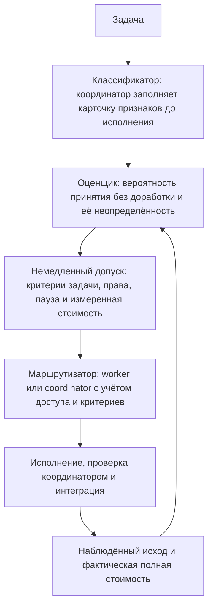

# Гибридная маршрутизация делегирования

DeepSeek Team объединяет ограниченный априорный сигнал из импортированных публичных результатов с исходами, реально наблюдавшимися в текущем проекте. Auto сразу допускает подходящую работу и показывает неопределённость оценок. Состояние маршрутизации хранится приватно для каждого проекта, решения и их причины сохраняются. Система не дообучает модель, не обещает результат бенчмарка и не трактует процент из публичного рейтинга как вероятность успеха на вашем коде.

Каждая команда принимает `--path PROJECT`. Результаты выводятся в JSON. `status` показывает текущее состояние, а `config --json` — эффективную конфигурацию.

```bash
deepseek-team routing status --path /path/to/repository --json
deepseek-team routing config --path /path/to/repository --json
```

## Три обязанности и один цикл обратной связи

Маршрутизация — это не обученная нейросеть-классификатор и не фиксированный процент делегирования. В ней есть три роли, которые работают вместе, и цикл, который возвращает наблюдённые результаты в следующее решение.



### Классификатор — это координатор, и он работает до исполнения

Координатор сам описывает задачу ещё до запуска исполнителя. План сохраняет это описание в карточке задачи. Для классификации не нужно обучать отдельную нейросеть:

- `kind`, `domain` и `operation` — вид работы, область и операция: например, реализация, Python, исправление ошибки.
- `localization` и `coupling` — известно ли место изменения и насколько оно связано с другими компонентами; `risk` и `scope_size` — риск и размер задачи; `clarity` и `verification` — понятность требований и способ проверки результата.
- `runtime`, `model`, `effort` и `context_version` — среда запуска, модель, глубина рассуждений и версия контекста. Результаты разных условий исполнения учитываются раздельно.

Неуказанные характеристики задачи — например, область, операция, риск и способ проверки — остаются `unknown`. Их нельзя додумывать ради уверенной оценки. У условий исполнения есть стандартные значения (`codex`, `deepseek-flash`, `medium`, контекст `default`), а вид работы и среду запуска задаёт план. Координатор должен сверить их с фактическим назначением. Если тип задачи неизвестен, её результаты не используются для оценки другой задачи. Архитектура, безопасность, интеграция, финальная проверка, commit/push, production и работа с секретами остаются у координатора.

### Оценщик — принятие без доработки и неопределённость

По сопоставимым записанным случаям оценщик вычисляет вероятность того, что результат worker будет принят без доработки, и вместе с ней — неопределённость этой вероятности. Универсальный процент делегирования он не предсказывает.

Случай учитывается только при совпадении известных `kind`, `domain`, `operation` и идентичности исполнения (`runtime`, `model`, `effort`, `context_version`). Остальные признаки — `localization`, `coupling`, `verification`, `clarity`, `risk`, `scope_size` — задают вес похожести: чем больше совпадений, тем больше вес. По мере накопления достаточного числа сопоставимых локальных результатов они могут перевесить ограниченный вклад внешних данных, а любое наблюдение теряет вес с возрастом, причём для успехов и неудач с одинаковым периодом полураспада. Более поздняя неудача по тому же случаю имеет приоритет над более ранним принятием, а повторные попытки одного случая не становятся независимыми успехами. Исходы `infrastructure`, `cancelled` и `unknown` не получают метки качества.

Расчёт использует два взвешенных счётчика: принятые результаты исполнителя и ошибки качества. Начальное распределение Beta(1,1) не отдаёт предпочтения успеху или неудаче. Каждый сопоставимый результат прибавляет вес к соответствующему счётчику. Средняя оценка равна `(1 + вес успехов) / (2 + вес успехов + вес ошибок)`, а интервал вероятности показывает оставшуюся неопределённость. Когда наблюдений мало, интервал широкий: одной успешной задачи недостаточно, чтобы считать исполнителя надёжным.

Публичные данные попадают сюда только через явный импорт: оператор указывает HTTPS-адрес источника и контрольную сумму SHA-256 файла. Вклад каждого семейства источников и всех внешних данных вместе ограничен. Встроенных баллов бенчмарков нет; хуки не загружают их в фоне. Обучение здесь означает обновление статистики по реальным результатам — без дообучения модели и отдельных платных заданий ради обучения.

### Маршрутизатор — немедленный выбор исполнителя

Рекомендации и назначения используют единый путь допуска. Маршрутизатор проверяет права, защищённые обязанности, признаки задачи, активную паузу семейства и подтверждённую невыгодность. Подходящая задача получает `worker`, остальные — `coordinator` с сохранённой причиной. Отсутствие истории качества или цен не мешает подходящему назначению. Оценка вероятности, её неопределённость и доступные данные о стоимости остаются видимыми; они не означают гарантии результата или экономии.

Экономический запрет требует сопоставимых измеренных затрат обоих исполнителей с весом не меньше `max(1, min_local_evidence)` у каждого. Если измеренная экономия ниже `minimum_savings_fraction` (по умолчанию 10%), назначение блокируется. Неизвестные затраты остаются неизвестными.

В режиме `auto` план с `executor: auto` получает конкретного исполнителя. Явный выбор и ручные профили `25`/`50`/`75` сохраняют приоритет. Новые настройки `delegation_level=auto, access=auto` разрешают только чтение; для записи нужен явный доступ.

### Цикл обратной связи

После каждого назначения координатор записывает то, что произошло на самом деле: наблюдённый исход (`accepted` — принято без доработки; `rework` и `rejected` — ошибки качества; `infrastructure`, `cancelled` и `unknown` остаются без метки) и фактическую полную стоимость. Эти наблюдённые результаты worker и координатора становятся данными для следующих оценок. Система сравнивает реально записанные результаты. Она не знает, как справился бы исполнитель, которому эту задачу не поручали.

При холодном старте немедленный допуск разрешает подходящую работу без ожидания истории. Оценки качества и стоимости продолжают обновляться; неизвестная стоимость не становится заявленной экономией.

### Небольшой пример: что известно до исполнения и что наблюдается позже

Допустим, координатор планирует небольшую задачу: «добавить флаг `--quiet` команде `status` и покрыть его модульным тестом», запускать в копии с `full-access`.

Факты, известные до исполнения и записанные в карточку признаков, результат их не меняет:

- `kind = implementation`, `domain = python`, `operation = extend`
- `localization = known`, `coupling = local`, `verification = tests`
- `clarity = clear`, `risk = low`, `scope_size = small`
- `runtime = codex`, `model = deepseek-flash`, `effort = medium`, `context_version = project-v1`

Наблюдается только после работы и записывается через coordination lifecycle:

- исход — например, `accepted` без доработки, либо `rework`/`rejected`, если проверка нашла проблемы;
- фактическая полная стоимость, включая проверку координатором и возможную доработку.

Карточка признаков сообщает оценщику, какие случаи сопоставимы, ещё до запуска задачи; а будущие оценки меняет именно наблюдённый исход. Карточку никогда не переписывают под результат. Формат JSON для того и другого показан в [запускаемом синтетическом примере](#запускаемый-синтетический-пример).

## Режимы и выбор исполнителя

В новой установке заданы `delegation_level="auto"`, режим `auto` и фактический доступ `read-only`. Для реализации явно выберите `deepseek-team config set --project --access full-access`. Импорт публичных данных не запускает платные эксперименты.

Уже сохранённое числовое предпочтение делегирования не перезаписывается незаметно. Ручные профили `25`, `50` и `75` остаются доступны, а реальные исходы их задач-worker продолжают пополнять локальные данные:

```bash
deepseek-team config set --project --path /path/to/repository --delegation-level 50
```

Режимы маршрутизации:

- `off` отключает решения маршрутизатора.
- `shadow` записывает предполагаемую рекомендацию, но не меняет выбор исполнителя.
- `advisory` возвращает рекомендацию для проверки координатором.
- `auto` может разрешить явно запрошенный `executor: auto`. Планы, где worker или coordinator уже выбран явно, сохраняют этого исполнителя. Если задача не проходит допуск, она остаётся у координатора с сохранённой причиной.

Автоматическая маршрутизация не расширяет настроенный уровень доступа. Архитектура, безопасность, интеграция, финальная проверка, commit/push, production и работа с секретами всегда остаются у координатора. Неизвестный или высокий риск и слабая проверяемость исключают автоматические назначения. Отсутствие истории и стоимости не блокирует подходящие задания.

Указывайте только изменяемые параметры:

```bash
deepseek-team routing configure --path /path/to/repository \
  --mode advisory \
  --confidence 0.95 \
  --min-local-evidence 5 \
  --external-weight-cap 5 \
  --source-weight-cap 2 \
  --half-life-days 90 \
  --max-evidence-age-days 365 \
  --min-similarity 0.60 \
  --minimum-savings-fraction 0.10 \
  --failure-cooldown-seconds 300
```

Нехватка данных о качестве и стоимости не задерживает подходящую задачу. Параметры оценщика управляют статистикой и её интерпретацией, но не требуют накопить минимальную историю качества перед первым назначением.

## Немедленный допуск по умолчанию

**По умолчанию Auto сразу делегирует подходящую работу**. Уже в первой сессии можно поручать небольшие и средние задачи с низким или средним риском, известной или частично известной локализацией, связями внутри участка или компонента, ясными требованиями и указанными тестами либо воспроизведением ошибки. Ручная проверка допустима для чтения, ревью, исследования, диагностики, планирования тестов и документации с явными критериями приёмки. Для реализации нужны исполняемые проверки и `full-access`.

Неизвестная стоимость остаётся неизвестной и не мешает допустимому назначению; подтверждённая измерениями невыгодность блокирует делегирование. Одна доработка учитывается без паузы. Отклонение результата или три разных случая доработки в окне cooldown приостанавливают семейство задач: на время `failure_cooldown_seconds` (по умолчанию 300 секунд). После паузы немедленные назначения возобновляются. Неудачная реализация автоматически не повторяется.

По умолчанию Auto разрешает **только чтение**. Чтобы делегировать реализацию, явно разрешите запись для проекта:

```bash
deepseek-team config set --project --access full-access
```

Координатор выделяет содержательные независимые части работы, проверяет реальный diff и заявленные проверки, сообщает принятые результаты и доработки. Повторять исследование воркера или придумывать процент экономии не нужно. Архитектура, безопасность, интеграция, финальная проверка, коммиты и production остаются у координатора. Ручные профили, явные права и `off` сохраняют приоритет.

### Очередь назначений и параллельное исполнение

Подходящие задания остаются назначенными воркерам, даже когда все места заняты. Назначение и запуск разделены: запуск ожидает своей очереди FIFO. По умолчанию одновременно работают **8 воркеров**, настройка допускает от 1 до 64. Каждому заданию с записью нужна собственная изолированная копия; параллельно выполняют только независимую работу.

```bash
deepseek-team config set --project --max-workers 8
# Либо настройка для пользователя:
deepseek-team config set --global --max-workers 8
# Переопределение для одного запуска:
deepseek-team worker --runtime codex --max-workers 4
```

По умолчанию ожидание и общее время не ограничены. `worker --no-wait` возвращает код нехватки мест `75`; явный `--timeout` включает время очереди. Перед обращением к провайдеру или чтением ключа запуск повторно проверяет `off`, права, разрешение маршрутизатора и HEAD проекта. Ожидание не расширяет доступ. Обязательная OS-изоляция, приватная сеть и фиксированный ретранслятор управляемых копий сохраняются.


## Состояние и жизненный цикл назначений

`deepseek-team routing status --path /path/to/repository --json` показывает активные паузы в `admission.active_cooldowns`. Параметр `failure_cooldown_seconds` допускает от 0 до 2592000 секунд; значение по умолчанию — 300.

Формат состояния маршрутизации — 3, файл — `routing-v3.sqlite3` в приватном каталоге проекта вне Git. Пакет не читает и не переносит данные из старых баз; их файлы остаются нетронутыми. Неподдерживаемая версия в текущей базе отклоняется. Формат внешних снимков для импорта — отдельный контракт, показанный ниже.

Если процесс координатора завершился после запуска назначения, сначала проверьте сохранённый diff worker и его workspace. Найдите и остановите все оставшиеся OS-процессы worker, затем убедитесь, что они действительно остановлены. Только после этого явно отмените осиротевшее выполняющееся назначение, указав конкретное свидетельство:

```bash
deepseek-team coordination abandon \
  --path /path/to/repository \
  --task TASK_ID \
  --assignment ASSIGNMENT_ID \
  --evidence "Проверен сохранённый diff; группа процессов worker остановлена и проверена" \
  --confirmed-stopped
```

`--confirmed-stopped` — подтверждение оператора, а не запрос DeepSeek Team на завершение процессов. Команда требует выполняющееся назначение и дополнительно проверяет через эксклюзивную блокировку workspace, что активного владельца больше нет. Отменить workspace, которым сейчас владеет живой процесс, нельзя. Успешная отмена записывает `cancelled`, не создаёт ошибки качества и завершает отмену назначения. Автоматических тайм-аутов отмены, повторных запусков и завершения процессов нет.

Для одной привязки задачи, результата работы и плана сохраняется одно исходное решение: повторная оценка использует его, без повторного выбора исполнителя. Отзыв доступа или изменение политики может сузить существующее разрешение; отклонённое назначение при этом не превращается в новое.

## Запускаемый синтетический пример

Следующий снимок намеренно синтетический. Он лишь демонстрирует формат импорта и не является настоящим бенчмарком или утверждением о качестве исполнителей.

```bash
PROJECT=/path/to/repository
NOW=$(date +%s)
cat > /tmp/deepseek-routing-example.json <<JSON
{
  "schema_version": 1,
  "format": "deepseek-team-evidence",
  "source_family": "synthetic-documentation-example",
  "observations": [
    {
      "id": "synthetic-public-observation-1",
      "case_id": "synthetic-public-case-1",
      "source_family": "synthetic-documentation-example",
      "features": {
        "kind": "implementation",
        "domain": "python",
        "operation": "extend",
        "localization": "known",
        "coupling": "local",
        "verification": "tests",
        "clarity": "clear",
        "risk": "low",
        "scope_size": "small",
        "runtime": "codex",
        "model": "deepseek-flash",
        "effort": "medium",
        "context_version": "example-v1"
      },
      "action": "worker",
      "outcome": "accepted",
      "observed_at": $NOW,
      "cost_usd": 0.04,
      "duration_seconds": 42
    }
  ]
}
JSON
SHA=$(sha256sum /tmp/deepseek-routing-example.json | cut -d' ' -f1)
deepseek-team routing import /tmp/deepseek-routing-example.json \
  --path "$PROJECT" \
  --source-id synthetic-doc-v1 \
  --source-url https://example.org/deepseek-routing-example.json \
  --sha256 "$SHA" \
  --reliability 0.2
```

Импортированные публичные данные остаются внешними. Их влияние ограничивают надёжность, сходство, давность, лимит семейства источников и общий внешний лимит. Объём импорта не может незаметно превратиться в опыт проекта.

Запросите рекомендацию с карточкой признаков. Модель, runtime, effort и версия контекста задают условия работы кандидата и не позволяют незаметно смешивать разные исполнения.

```bash
cat > /tmp/feature-card.json <<'JSON'
{
  "kind": "implementation",
  "domain": "python",
  "operation": "extend",
  "localization": "known",
  "coupling": "local",
  "verification": "tests",
  "clarity": "clear",
  "risk": "low",
  "scope_size": "small",
  "runtime": "codex",
  "model": "deepseek-flash",
  "effort": "medium",
  "context_version": "example-v1"
}
JSON
deepseek-team routing recommend --path "$PROJECT" --file /tmp/feature-card.json --access read-only
```

Один синтетический внешний результат не подтверждает надёжность. Подходящую работу можно назначить и при высокой статистической неопределённости. Ответ содержит действие, коды причин, апостериорную неопределённость и доступные экономические показатели. Новая модель или версия контекста начинает с высокой неопределённости.

После первого значимого исхода реальной задачи проекта запишите то, что действительно произошло. `accepted` означает финальное принятие без доработки; `rework` и `rejected` считаются неудачами. `infrastructure`, `cancelled` и `unknown` остаются без метки качества. `cost_usd` — полная измеренная стоимость, включая работу worker, проверку и доработку. Нельзя выдумывать исход или стоимость невыбранного исполнителя.

```bash
NOW=$(date +%s)
cat > /tmp/local-observation.json <<JSON
{
  "id": "local-observation-1",
  "case_id": "project-case-1",
  "origin": "local",
  "features": {
    "kind": "implementation",
    "domain": "python",
    "operation": "extend",
    "localization": "known",
    "coupling": "local",
    "verification": "tests",
    "clarity": "clear",
    "risk": "low",
    "scope_size": "small",
    "runtime": "codex",
    "model": "deepseek-flash",
    "effort": "medium",
    "context_version": "example-v1"
  },
  "action": "worker",
  "outcome": "accepted",
  "observed_at": $NOW,
  "cost_usd": 0.06,
  "duration_seconds": 75
}
JSON
deepseek-team routing observe --path "$PROJECT" --file /tmp/local-observation.json
```

Результат обычной координируемой работы следует записывать через команды coordination. `--cost-usd` задаёт полную измеренную стоимость, включая исполнение, проверку координатором и все доработки:

```bash
deepseek-team coordination use --path "$PROJECT" \
  --task TASK_ID --assignment ASSIGNMENT_ID \
  --disposition incorporated --evidence "Объявленные проверки и ревью пройдены" \
  --cost-usd 0.06

deepseek-team coordination result --path "$PROJECT" \
  --task TASK_ID --deliverable DELIVERABLE_ID \
  --outcome accepted --evidence "Объявленные проверки и финальное ревью пройдены" \
  --cost-usd 0.40
```

Для результата coordinator допустимы `accepted`, `rework`, `rejected`, `infrastructure`, `cancelled` и `unknown`. В наблюдении с действием coordinator карточка всё равно описывает идентичность кандидата-worker: так можно сравнивать сопоставимые наблюдения worker и coordinator.

Низкоуровневая команда `routing observe` предназначена для исторических данных, сообщаемых доверенным оператором. Без корректного сохранённого decision ID она не может гарантировать, что карточка признаков была зафиксирована до исполнения, поэтому при доступном coordination lifecycle не следует заменять его этой командой. Исправления локального случая хронологичны и неизменяемы: каждая фаза остаётся в истории аудита, а любая наблюдавшаяся ошибка качества `rework` или `rejected` имеет приоритет над более ранней или поздней фазой `accepted`. Повторные попытки одного случая не становятся независимыми свидетельствами.

## Импорт, загрузка, оценка и экспорт

`import` читает локальные байты и никогда не обращается к сети. Команда требует HTTPS-адрес происхождения и SHA-256 точных байтов. Сетевой запрос выполняет только явная команда `fetch`; она также требует закреплённый хеш и отклоняет небезопасные адреса:

```bash
deepseek-team routing fetch https://data.example.org/run.json \
  --path /path/to/repository \
  --source-id public-run-2026-09 \
  --sha256 0123456789abcdef0123456789abcdef0123456789abcdef0123456789abcdef \
  --reliability 0.5
```

Оценка идёт хронологически: прогноз для каждого случая считается до изучения его исхода, а повторяющиеся case ID группируются. Ретроспективное исправление сохраняет исходный прогноз; оценка учитывает исправление только при достижении его временной метки.

```bash
deepseek-team routing evaluate --path /path/to/repository
deepseek-team routing export --path /path/to/repository --output /tmp/routing-export.json
```

`export` передаёт текущий JSON с `schema_version: 3` потоком и не загружает всю историю проекта в память. Без `--output` этот JSON записывается непосредственно в stdout. Файл создаётся с приватными правами и заменяется атомарно, поэтому прерванный экспорт не заменит существующий корректный файл. Экспорт — локальная операция чтения: она не запускает worker, не обращается к провайдеру модели и не начинает платное действие.

Оценка сообщает хронологическую калибровку, Brier score и log loss, а также фактически записанные исходы и измеренные затраты, когда они доступны. Прогнозы описывают вероятность принятия и неопределённость; они не выбирают исполнителя и не оценивают политику делегирования. Эти сводки не доказывают формальную корректность или контрфактическую экономию.

## Бюджеты экспериментов

Резервирования явные, постоянные, атомарные и идемпотентные. Они учитывают сумму, разрешённую для вручную запрошенного дополнительного эксперимента в рамках лимитов на запуск и месяц. Маршрутизатор никогда автоматически не запускает дополнительные платные эксперименты. Реестр не применяется к обычным задачам проекта, включая автоматически назначенную работу. Это внутренний механизм учёта DeepSeek Team, а не лимит биллинга провайдера; он не гарантирует жёсткое ограничение расходов. Превышение при расчёте блокирует последующие резервы экспериментов. Автоматических повторных запусков worker нет.

```bash
deepseek-team routing configure --path /path/to/repository \
  --monthly-experiment-budget-usd 10 --per-experiment-limit-usd 2
deepseek-team routing budget reserve experiment-2026-09-23 --path /path/to/repository --amount-usd 1.50
deepseek-team routing budget settle experiment-2026-09-23 --path /path/to/repository --actual-usd 1.35
# Либо освободите неиспользованный резерв:
deepseek-team routing budget release experiment-2026-09-23 --path /path/to/repository
```
